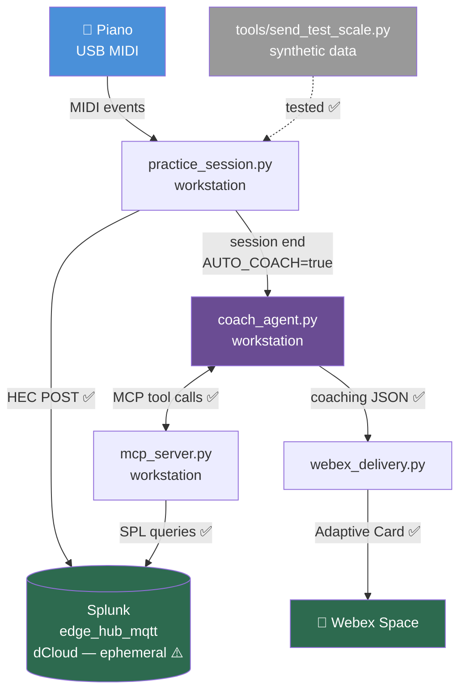

# Project State — Phase 1 Pipeline Working End-to-End (Synthetic Data)
*April 25, 2026 — afternoon*

## Summary

The full Phase 1 pipeline is working end-to-end with synthetic test data. A simulated C Major scale generated by `tools/send_test_scale.py` was published directly to Splunk via the new HEC publisher, retrieved by the MCP server, analyzed by the agentic Claude coach, and delivered to Webex as an Adaptive Card. The agent autonomously made 6 MCP tool calls across 3 iterations before generating its coaching report.

This is the first time the entire path — capture → store → analyze → deliver — has been confirmed working with the new direct-to-Splunk architecture (no Node-RED in the loop).

The remaining Phase 1 work is to confirm the same pipeline works with **real piano data** (the synthetic test path doesn't run `practice_session.py`, so the live MIDI capture half is still untested in this rotation).

---

## Current Architecture (working)



---

## What Got Confirmed Today

| Component | What was verified |
|-----------|-------------------|
| `hec_publisher.py` | Direct POST to Splunk HEC; events land in `index=edge_hub_mqtt` with both `piano/notes` and `piano/sessions` sources |
| `mcp_server.py` | All 5 MCP tools query Splunk REST API and return parsed results |
| `coach_agent.py` | Claude (`claude-opus-4-7`) autonomously planned and executed 6 tool calls, synthesized findings, returned valid structured JSON |
| `webex_delivery.py` | Adaptive Card posted successfully (Webex returned a message ID) |
| `.env.tpl` + 1Password | All 5 secret references resolve correctly at runtime |

---

## Key Technical Insights Gained

### Splunk has two distinct token concepts
- **HEC token** — for ingest (POST to `:8088/services/collector/event`). Header: `Authorization: Splunk <token>`. Stored in 1Password as `splunk_hec_token`.
- **Authentication token** — for REST API queries (`:8089/services/search/jobs`). Created via *Settings → Tokens*. Stored in 1Password as `dcloud splunk api token`.

These are NOT interchangeable. The HEC token cannot run searches, and the auth token cannot ingest events. Both rotate when dCloud rotates.

### dCloud token gotcha
When generating a Splunk authentication token, the JWT value is shown **only once** in the creation dialog. The token list page shows only metadata, not the JWT. If the dialog closes without copying the value, the token is unrecoverable and a new one must be generated. Token format varies by Splunk version — sometimes `eyJ...` JWT, sometimes opaque base64.

### Agentic loop behavior
The coach agent doesn't call tools in a fixed sequence — it decides what to call based on what the data reveals. For the synthetic session, it called `compare_hands` and `get_recent_sessions` first (orientation), then `get_scale_history` and `get_finger_trends` for both hands (pattern hunting), then `get_session_detail` (drilling in), then synthesized. This is what makes it agentic vs. scripted: the order and selection of tool calls is chosen at runtime.

### Threading consideration
`AUTO_COACH` runs the agent at session end. The coach call must run **outside** the lock that protects MIDI ingestion, otherwise incoming notes during analysis (10–30 seconds) would be blocked. This was fixed in `practice_session.py` already.

---

## Running with the Real Piano

When you come back, follow these steps to test with the piano:

### 1. Verify dCloud connectivity
The dCloud session is ephemeral — if the lab has rotated since the last test, you'll need to:
```powershell
# In an admin PowerShell:
route add 198.18.0.0 mask 255.255.0.0 100.127.43.1
```
See `notes/2026-04-25 - To do when connecting to a new dCloud session.md` for the full checklist.

### 2. Plug in the piano
Connect the piano via USB. Confirm Windows recognizes the MIDI device.

### 3. Run a session
```bash
op run --env-file=.env.tpl -- python src/practice_session.py
```

You'll be prompted for max session minutes (default 5). Then:
- The script lists MIDI ports and connects to the first one
- Play any major scale with **both hands together**, 2 octaves up and back down
- Pause for at least **2 seconds** between scales — that's the segment boundary
- Each completed scale = one segment = one Webex card (because `AUTO_COACH=true`)

Press **Ctrl+C** to end the session.

### 4. What to expect

For each completed scale:
- Console shows real-time per-note logging (`♪ C4 RH finger:Thumb t:0ms`)
- After 2-second silence, a segment summary table prints
- HEC publisher posts events to Splunk (silent unless there's an error)
- Coach agent runs (~10-30 seconds — console shows `[coach] Analyzing session...`)
- Webex card appears in your Webex space

### 5. Disable auto-coach if you want to play multiple scales without interruption

If you want to play a longer practice session without a card after every scale:
```bash
$env:AUTO_COACH = "false"   # PowerShell — only this session
op run --env-file=.env.tpl -- python src/practice_session.py
```

Then run `coach_agent.py` manually afterward against any specific session, or omit the argument to run on the most recent:
```bash
op run --env-file=.env.tpl -- python src/coach_agent.py
op run --env-file=.env.tpl -- python src/coach_agent.py 20260425_143012  # specific session
```

### 6. Check the data afterward

In Splunk Web (`http://198.18.135.50:8000`):
```spl
index=edge_hub_mqtt source="piano/sessions" | table _time, scale_display, segment_index, session_id
```
See `notes/splunk_spl_cheat_sheet.md` for more queries.

---

## What's Not Yet Tested

- **Live MIDI capture** — `practice_session.py` running with the piano
- **Multiple-segment session** — does AUTO_COACH fire correctly for each segment?
- **Real coaching value** — does the agent's analysis read as useful when given real (not synthetic) data?

## Known Issues / Deferred

- `get_finger_trends` deviation values are misleading — uses cumulative time deltas instead of IOI (inter-onset interval) within each segment. Visible in today's test output: finger 5 showing `+910ms` deviation is a measurement artifact, not a real timing issue. Fix before pre-recording demo sessions.
- dCloud Splunk wipes weekly — longitudinal coaching ("3-week trend on your ring finger") needs cloud Splunk to be meaningful. Decision still pending.

---

## Next Steps

1. **Real piano session test** (next time at the workstation)
2. **Cloud Splunk decision** — Splunk Cloud trial vs. Splunk Free on GCP VM
3. **Fix `get_finger_trends`** — IOI-based deviation per segment
4. **Pre-record demo sessions** for the April 30 deadline
