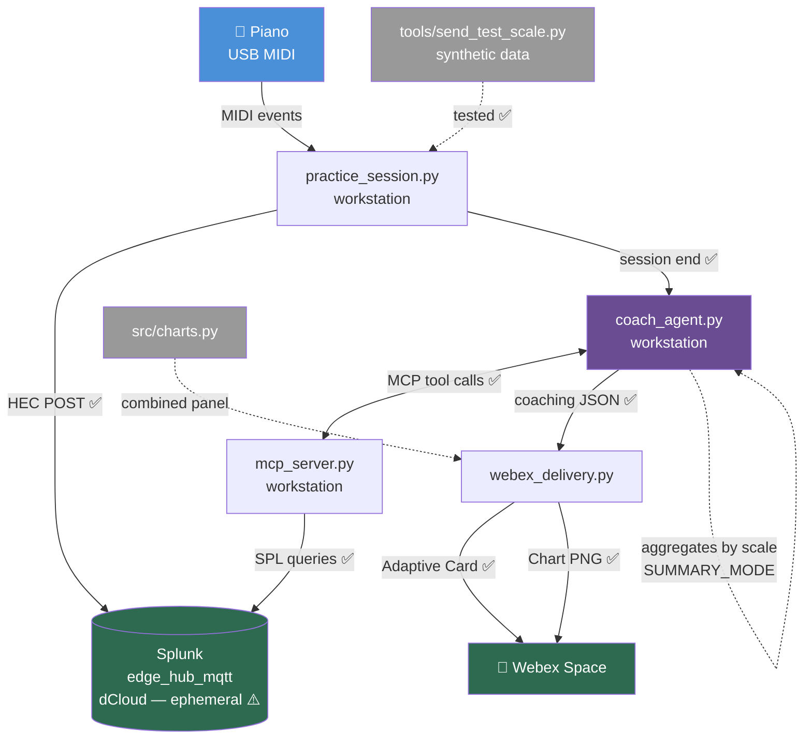

# Project State — Phase 1.5 Summary Mode + Charts Working
*April 25, 2026 — afternoon, second checkpoint*

## Summary

Phase 1.5 is substantially in place. The pipeline now supports two new opt-in modes that build *on top of* the working Phase 1 pipeline without replacing anything:

1. **Summary mode** — instead of one Webex card per scale segment, one card per *scale-type* per session, with best/typical/within-session-trend coaching across all the reps
2. **Charts** — every summary card carries a combined PNG with cross-session trend (BPM and CV%) and per-finger timing deviation

The known correctness issue with `get_finger_trends` was also fixed — it now reports IOI-based deviation rather than scale-position-bias, so values are actually meaningful for coaching.

End-to-end verified: real Splunk data → summary report (Claude agent) → combined chart PNG → Webex card and chart posted as two consecutive messages.

---

## Current Architecture (working)



---

## What Was Added Since Last Checkpoint

| Component | File | What it does |
|-----------|------|--------------|
| Summary system prompt | `src/coach_agent.py` | New `SUMMARY_SYSTEM_PROMPT` that asks Claude to coach across multiple reps of one scale (best/typical/within-session trend) |
| Summary entry point | `src/coach_agent.py` | `run_coach_summary(session_id, scale)` |
| Shared agent loop | `src/coach_agent.py` | `_run_agent_loop()` helper used by both `run_coach` and `run_coach_summary` |
| Summary mode wiring | `src/practice_session.py` | `SUMMARY_MODE` env var; tracks distinct scales played; fires one summary per scale at session end (skips per-segment cards in this mode) |
| Charts module | `src/charts.py` | `render_session_trend`, `render_finger_deviation`, `render_summary_panel` (combined PNG) |
| Webex chart attachment | `src/webex_delivery.py` | `post_card(report, attachment=...)` — sends two messages (card then chart) since Webex doesn't accept both in one multipart |
| SPL correctness | `src/mcp_server.py` | `get_finger_trends` rewritten to compute IOI-based deviation, filtering segment-boundary gaps |
| Plan + outline updates | `plan/implementation_plan.md`, `plan/ai_preso_v2_jun_2026/` | Phase 1.5 reorganized as layer-on modes; charts replace the keyboard viz on the critical path |

---

## Key Technical Insights from This Round

### Webex multipart limitation
Webex Messages API does not accept Adaptive Card `attachments` and file uploads in the same multipart request — it returns a generic 500. Confirmed by isolating components: file + markdown alone works, card + JSON alone works, both together fails. The cleanest workaround is two consecutive messages: card first (the headline), chart second.

### IOI-based deviation, not position-based
The original `get_finger_trends` SPL took `time_ms - session_mean(time_ms)` per note, which just measured scale position (early notes negative, late notes positive). The correct calculation is per-IOI deviation from the session's mean IOI. Filtering `ioi_ms < 1000` cleanly excludes the 2-second gaps between segments.

### Modes as composition, not replacement
`SUMMARY_MODE` is an env var that opts into a different end-of-session behavior; per-segment cards remain the default. This pattern (default + opt-in additive mode) is much friendlier than rip-and-replace.

### Webex token type confusion (recurring)
Splunk has two distinct token concepts (HEC vs REST API). They're not interchangeable. The HEC token uses `Authorization: Splunk <t>` for ingest; the REST API uses the same prefix but expects a different token type from Settings → Tokens. Wasted ~30 minutes today on this.

---

## Updated Usage Instructions

### dCloud session setup (each rotation)

```powershell
# In an admin PowerShell:
route add 198.18.0.0 mask 255.255.0.0 100.127.43.1
```

Verify the gateway IP matches your AnyConnect adapter — it's dynamic. See `notes/2026-04-25 - To do when connecting to a new dCloud session.md` for the full checklist (also covers refreshing the Splunk REST token in 1Password).

### Running the pipeline

> Behavioral toggles (`SUMMARY_MODE`, `AUTO_COACH`, `PUBLISHER_TYPE`) are intentionally NOT in `.env.tpl` — `op run --env-file=...` would otherwise inject those values *over* whatever you set in PowerShell. Set them in the shell *before* `op run`. Defaults live in the Python code.

**Default mode — per-segment cards (one Webex card after each scale played):**
```powershell
op run --env-file=.env.tpl -- python src/practice_session.py
```

**Summary mode — one card per scale-type at session end (with charts):**
```powershell
$env:SUMMARY_MODE="true"; op run --env-file=.env.tpl -- python src/practice_session.py
```

After Ctrl+C, the script:
1. Processes the final segment
2. Pauses 3 seconds for HEC ingest
3. For each distinct scale played, runs `run_coach_summary()` and posts an Adaptive Card + chart panel to Webex

**Suppress automatic coaching entirely (data still goes to Splunk):**
```powershell
$env:AUTO_COACH="false"; op run --env-file=.env.tpl -- python src/practice_session.py
```

**Run the coach manually after the fact:**
```powershell
# Most recent session, per-segment style:
op run --env-file=.env.tpl -- python src/coach_agent.py

# Specific session ID:
op run --env-file=.env.tpl -- python src/coach_agent.py 20260425_082219
```

### Smoke tests (no piano needed)

```powershell
# Push synthetic test scale events to Splunk:
op run --env-file=.env.tpl -- python tools/send_test_scale.py

# Verify all 5 MCP tools query Splunk correctly:
op run --env-file=.env.tpl -- python tools/test_mcp_tools.py
```

### Generating charts standalone (without sending to Webex)

```powershell
op run --env-file=.env.tpl -- .venv/Scripts/python.exe -c "
import sys; sys.path.insert(0, 'src')
from charts import render_summary_panel
from mcp_server import _dispatch
scale = 'c_major'
print(render_summary_panel(
    scale,
    _dispatch('get_scale_history',  {'scale': scale}),
    _dispatch('get_finger_trends',  {'scale': scale, 'hand': 'right'}),
    _dispatch('get_finger_trends',  {'scale': scale, 'hand': 'left'}),
    session_id='ADHOC',
))
"
```

PNGs land in `data/viz/<session_id>_<scale>_summary.png`.

### Environment variables

**In `.env.tpl`** — endpoints, tokens, and other config that's stable per-environment:

| Variable | Source | Purpose |
|----------|--------|---------|
| `SPLUNK_HEC_URL` | dCloud HEC | Splunk HEC ingest endpoint |
| `SPLUNK_HEC_TOKEN` | 1P ref | HEC auth token |
| `SPLUNK_URL` | dCloud REST | Splunk REST API (port 8089) |
| `SPLUNK_TOKEN` | 1P ref | REST API authentication token |
| `SPLUNK_INDEX` | hardcoded | `edge_hub_mqtt` |
| `WEBEX_BOT_TOKEN` | 1P ref | Webex bot token |
| `WEBEX_ROOM_ID` | hardcoded | The space cards get posted to |
| `ANTHROPIC_API_KEY` | 1P ref | Claude API key |

**Behavioral toggles** — set in the shell *before* `op run`, defaults defined in code:

| Variable | Code default | Purpose |
|----------|--------------|---------|
| `PUBLISHER_TYPE` | `hec` | `hec` or `mqtt` (legacy path) |
| `AUTO_COACH` | `true` | Set `false` to fully suppress coaching |
| `SUMMARY_MODE` | `false` | Set `true` for end-of-session summary cards (one per scale) |

> ⚠️ Don't put toggles in `.env.tpl` — `op run --env-file=...` injects values from the file *over* whatever you set in PowerShell, so a hardcoded `SUMMARY_MODE=false` in the file would silently override `$env:SUMMARY_MODE="true"`.

---

## What's Next

In priority order:

1. **Real piano session in `SUMMARY_MODE=true`** — verifies the post-Ctrl+C flow with multiple scales and multiple reps. This is the first user-action item next session.
2. **Demo orchestrator (P1.5.4)** — wraps a session run and writes a progressively-built Markdown log with explanations, code snippets, and partial Mermaid diagrams. Multi-hour build, do with fresh capacity.
3. **Cloud Splunk decision** — Splunk Cloud trial vs Splunk Free on GCP VM. Without persistence, the longitudinal coaching story is a 1-day arc.
4. **Pre-record demo sessions** — once the pipeline is stable, capture 5-10 real sessions for the April 30 draft.
5. **Keyboard viz integration (deferred)** — the SVGs in `plan/ai_preso_v2_jun_2026/` (black + grey) are ready as base assets. Programmatic finger-highlight overlay is a polish item, not on the v2 critical path.

---

## What's Not Tested Yet

- **Real piano session in `SUMMARY_MODE=true`** with multiple scales and multiple reps — end-of-session summary fires for each scale, both cards land
- **`AUTO_COACH=false` + manual `coach_agent.py` invocation** with the new IOI-based finger trends
- **Multi-hour-old data in trend chart** — the chart auto-scales the time axis but only short-span data has been exercised

## Known Issues / Deferred

- dCloud Splunk wipes weekly. Decision pending on cloud option.
- The `requests` library was added as a dependency but `requirements.txt` doesn't reflect it. Worth adding when convenient.
- `MQTT_HOST`/`MQTT_PORT` env vars in `.env.tpl` are still there for the fallback MQTT path; dCloud rotation breaks them but they're not on the active path.
