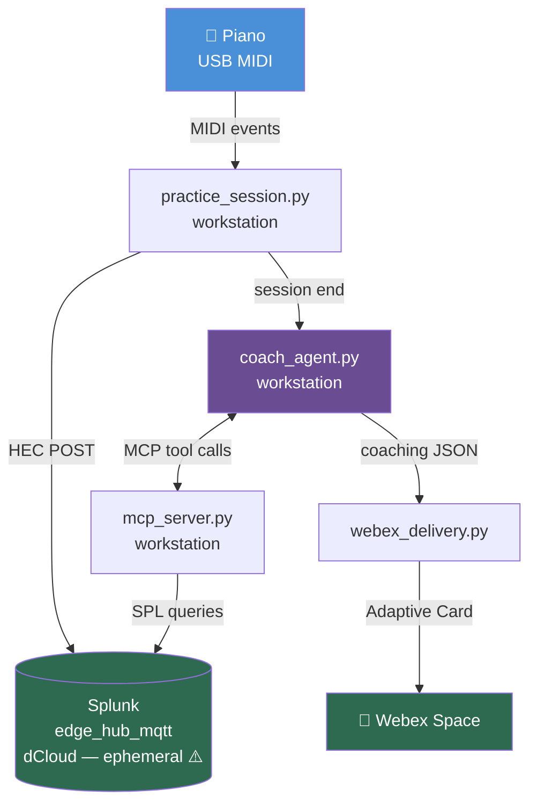

# Project State — Phase 1 Starting Point
*April 25, 2026*

## Summary

The AI Music Coach project is a personal piano practice system that treats the piano as a sensor network. MIDI note events from a USB-connected piano are captured, scored, sent to Splunk for storage, and analyzed by an AI coach (Claude) that delivers structured feedback via Webex. The project is built deliberately to span many technologies — MIDI, data pipelines, MCP, AI agents, and automation — because each one is both a learning opportunity and a presentation talking point.

The core pipeline is fully coded as of today. The HEC path (direct Splunk ingest, no Node-RED) was completed and confirmed working this morning. End-to-end testing (piano → Splunk → coach → Webex card) is the immediate next step.

---

## Current Architecture



Everything runs on the workstation. No cloud dependencies in the core path except the Claude API and Webex.

---

## Key Technical Elements

### MIDI Capture — `src/practice_session.py`
Python captures live NOTE_ON events from a USB MIDI piano using `python-rtmidi`. It splits the single MIDI stream into left and right hands by proximity (whichever hand's last note is closest to the incoming note). It detects which scale is being played by narrowing candidates in real time as each note arrives — once only one scale matches, it locks in and assigns finger numbers. At the end of each scale run (2-second silence = segment boundary), it scores the segment and triggers the coach.

### HEC Publisher — `src/hec_publisher.py`
Posts events directly to Splunk's HTTP Event Collector (HEC) via a plain HTTP POST. This replaced a more complex chain (MQTT → Ubuntu broker → Node-RED → Splunk) that required manual setup on every dCloud lab rotation. The new path is a direct HTTP POST from the workstation to Splunk — simpler and more reliable.

**Payload format:**
```json
{
  "event": { "session_id": "...", "scale": "c_major", "hand": "right", ... },
  "index": "edge_hub_mqtt",
  "source": "piano/notes"
}
```

Two event types:
- `piano/notes` — one event per NOTE_ON (real-time note data with finger, timing, velocity)
- `piano/sessions` — one event per completed segment (speed, evenness, per-finger metrics)

### MCP Server — `src/mcp_server.py`
An MCP (Model Context Protocol) server that exposes Splunk practice data as tools Claude can call autonomously. MCP is Anthropic's open standard for giving AI models access to external data and systems. The server defines 5 tools:

| Tool | What it returns |
|------|----------------|
| `get_recent_sessions` | Last N sessions with speed/evenness for both hands |
| `get_session_detail` | Full note-level data for one session including finger timing |
| `get_finger_trends` | Per-finger timing deviation history across sessions |
| `compare_hands` | LH vs RH speed/evenness delta for a session |
| `get_scale_history` | Speed and evenness trend over all recorded sessions for one scale |

### AI Coach Agent — `src/coach_agent.py`
An agentic Claude loop (model: `claude-opus-4-7`) that autonomously decides which MCP tools to call, calls them, synthesizes the results, and returns a structured coaching report. "Agentic" means Claude decides its own tool-calling sequence — it's not scripted. It typically makes 4–6 tool calls per session, building up context before writing the report.

**Output schema:**
```json
{
  "summary": "2-3 sentence assessment with trend context",
  "strengths": ["specific strength with data"],
  "focus_areas": ["area with finger numbers"],
  "suggested_next_session": "actionable practice instruction",
  "trend": "improving | stable | needs_attention",
  "trend_detail": "1-2 sentences on the metric driving trend",
  "milestone": "personal best or empty string"
}
```

### Webex Delivery — `src/webex_delivery.py`
Posts the coaching report as a Webex Adaptive Card v1.2 — a structured, visually rich message with color-coded trend indicator (green/yellow/red), bullet lists for strengths and focus areas, and a milestone callout if a personal best was set. Delivered to a Webex space via the Webex bot API.

### Secrets Management
All secrets (API keys, tokens) are stored in 1Password and injected at runtime via the 1Password CLI:
```bash
op run --env-file=.env.tpl -- python src/practice_session.py
```
`.env.tpl` contains only 1Password references (e.g. `op://Private/splunk_hec_token/credential`). No real values ever touch disk or git.

---

## What's Working Today

- ✅ MIDI capture and real-time scoring (speed, evenness, per-finger timing)
- ✅ Direct HEC publish — `send_test_scale.py` confirmed events landing in Splunk
- ✅ MCP server — 4 of 5 tools confirmed working against live Splunk data
- ✅ Coach agent — tested live, correctly identified session milestones and fatigue patterns
- ✅ Webex card delivery — confirmed rendering in Webex desktop client
- ⏳ End-to-end: piano → Splunk → coach → Webex card (coded, not yet tested together)

## What's Not Working Yet

- `get_finger_trends` MCP tool returns misleading deviation values — known issue, fix deferred
- No persistent Splunk — dCloud rotates weekly, wiping all session history
- End-to-end pipeline not yet tested as a unit

## Immediate Next Steps

1. Run `tools/test_mcp_tools.py` — confirm Splunk queries work with current dCloud instance
2. Run full pipeline end-to-end: play a scale → confirm Webex card arrives
3. Decide on cloud Splunk option (Splunk Cloud trial vs. GCP VM)
