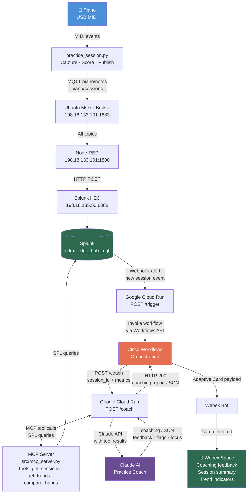

# AI Music Project — Implementation Plan
*Last updated: April 18, 2026*

---

## Project Purpose

Two goals running in parallel:

1. **Learning lab** — use piano practice as a hands-on way to build skills across MIDI, data pipelines, AI APIs, MCP, agents, and automation platforms simultaneously.
2. **Presentation foundation** — demonstrate that personal interests are a powerful way to develop AI/data skills that transfer directly to work. The premise: *"I used my piano practice as a sensor network. Same patterns I use at work — I just learned them at home first."*

The tool choices (MIDI, MQTT, Splunk, Cisco Workflows, Claude, MCP, Webex) are deliberately varied for breadth of learning, not just engineering efficiency.

**Presentations this serves:**
- AI music / hobby-as-AI-lab demo
- Cisco Workflows standalone presentation (this project is the live demo use case)
- The Workflows demo itself may also be included as part of the main presentation

---

## Architecture Overview



---

## What Is Already Built

### `src/midi_test.py` — COMPLETE
Simple proof-of-concept. Opens the first MIDI port, listens for events, prints NOTE ON / NOTE OFF with note names and velocities to the terminal. No file output. Used to verify Python can hear the piano.

**To run:**
```bash
cd "c:\Users\jpbar\My Drive\Technical Projects\ai-music-project"
.venv\Scripts\activate
python src/midi_test.py
# Press Ctrl+C to stop
```

### `src/piano_roll.py` — COMPLETE
Full Phase 1 pipeline. Records MIDI for a set duration (default 15s), saves a `.mid` file, then renders a dark-themed piano roll PNG showing notes by pitch and time, coloured by key type (blue = white keys, pink = black keys), brightness scaled to velocity.

**To run:**
```bash
cd "c:\Users\jpbar\My Drive\Technical Projects\ai-music-project"
.venv\Scripts\activate
python src/piano_roll.py
# Play for 15 seconds — outputs data/recording.mid and data/recording_roll.png
```

**Output files** (in `data/`, gitignored):
- `data/recording.mid` — raw MIDI file
- `data/recording_roll.png` — piano roll image

### Infrastructure
- `reapy-next` patched for Python 3.13 — Reaper bridge confirmed working
- Patch documented in `notes/Reapy_Patch_Notes.md`, automated via `patch_reapy.bat`

---

## Phase 3 — AI Practice Coach (ACTIVE)
*Target: ~2 weeks from April 2026*

### 3.1 — Structured Scale Practice Capture
**Goal:** Replace free-form recording with structured, scoreable practice sessions.

**What to build** (`src/practice_session.py`):
- Define finger-to-note mappings per scale (e.g. C major: thumb=C, index=D, middle=E, ring=F, pinky=G, etc. — both hands)
- Accept a practice config at runtime: which scale, which hand
- Capture raw MIDI with high-precision timestamps
- Compute per-session metrics:
  - **Speed** — average BPM across the scale run
  - **Evenness** — timing variance between consecutive notes (std dev of inter-note intervals)
  - **Per-finger analysis** — map each note back to its expected finger, flag timing outliers
- Output: structured JSON session summary + raw `.mid` file

*Deferred to Phase 4: articulation modes (legato/staccato)*

### 3.2 — MQTT Publisher
**Goal:** Send session data to Splunk via MQTT in real time (or on session completion).

**What to build** (`src/mqtt_publisher.py`):
- Connect to local MQTT broker (or Splunk Edge Hub directly if it supports direct MQTT)
- Two message types:
  - **Raw note events** — one MQTT message per NOTE_ON/NOTE_OFF, published during session
  - **Session summary** — one structured JSON message at session end (speed, evenness, finger scores)
- Topic structure e.g.: `piano/notes/raw`, `piano/session/summary`

**Dependencies to add:** `paho-mqtt`

### 3.3 — Splunk Configuration
**Goal:** Ingest MQTT data into Splunk, build SPL queries for analysis.

**Steps:**
- Configure Splunk Edge Hub MQTT input (topics: `piano/#`)
- Define two sourcetypes: `piano:note` and `piano:session`
- Write SPL to:
  - Surface session scores over time (trending)
  - Identify weakest finger per scale
  - Compare left hand vs. right hand evenness

### 3.4 — AI Coaching Pipeline (Workflows + MCP + Claude + Webex)

**Goal:** Automate the full coaching loop — a new practice session triggers an agentic AI analysis delivered as a Webex Adaptive Card.

**Key design decisions:**
- Workflows orchestrates but does not analyze — it delegates to Claude
- Claude acts as a true agent: it receives a trigger, autonomously queries Splunk via MCP tools to build context, then generates coaching feedback
- `/coach` returns a plain HTTP JSON response — Workflows reads it synchronously, no callback needed
- Claude is the coaching model (analytical depth); Gemini assists with generating Cloud Run infrastructure code from the design spec below
- Webex Adaptive Card is the sole output — visually compelling for a Cisco-ecosystem presentation

---

#### 3.4.1 — Splunk Alert → Cloud Run Trigger

**What:** Splunk webhook alert fires when a new `piano/sessions` event arrives in `edge_hub_mqtt`.

**How:**
- In Splunk: **Alerts → Create Alert** → search `index=edge_hub_mqtt source="piano/sessions"` → trigger when results > 0 → webhook action → POST to Cloud Run `/trigger`
- Cloud Run `/trigger` receives the payload, extracts `session_id`, calls Cisco Workflows API to start the session workflow

**Files:** `cloud/main.py` — Flask/FastAPI app with `/trigger` and `/coach` routes

---

#### 3.4.2 — MCP Server (`src/mcp_server.py`)

**What:** Python MCP server exposing Splunk as callable tools for Claude.

**Tools to expose:**

| Tool | Arguments | Returns |
|------|-----------|---------|
| `get_recent_sessions` | `count: int` | Last N session summaries (scale, speed, evenness, segment_index) |
| `get_session_detail` | `session_id: str` | Full note-level data for one session |
| `get_finger_trends` | `scale: str, hand: str, sessions_back: int` | Per-finger timing history across sessions |
| `compare_hands` | `session_id: str` | LH vs RH speed and evenness delta for a session |
| `get_scale_history` | `scale: str` | Speed and evenness trend over all sessions for a scale |

**Implementation:** Uses `mcp` Python SDK. Each tool runs a SPL query against the Splunk REST API (`https://198.18.135.50:8089/services/search/jobs`) and returns structured JSON.

**Hosting:** Same Cloud Run container as the trigger/coach routes, started as a subprocess or sidecar.

---

#### 3.4.3 — Claude AI Agent (`src/coach_agent.py`)

**What:** Agentic Claude session — Claude autonomously decides what to look up before generating coaching feedback.

**How it works:**
1. Receives `session_id` and current session metrics
2. Claude is initialized with a coaching system prompt (see below)
3. Claude decides which MCP tools to call (e.g. pulls last 5 sessions, checks finger trends for weak fingers, compares hands)
4. After gathering context, Claude writes a structured coaching report
5. Returns JSON to the `/coach` route, which returns it as an HTTP 200 response to Workflows

**System prompt:**
```
You are an expert piano practice coach analyzing a student's scale practice data.
You have access to tools that query the student's full practice history in Splunk.
When given a new session, autonomously investigate the data to build context:
- Check recent session trends (improving, plateauing, declining?)
- Identify the weakest finger(s) based on timing deviation
- Compare left and right hand consistency
- Note any scale-specific patterns

Return a JSON object with these fields:
{
  "summary": "2-3 sentence overall assessment",
  "strengths": ["list of what went well"],
  "focus_areas": ["list of specific things to work on, with finger numbers"],
  "suggested_next_session": "one concrete practice instruction",
  "trend": "improving | stable | needs_attention"
}
```

---

#### 3.4.4 — Cisco Workflows

**Two workflows to build:**

**Workflow 1 — Session Coaching** (triggered by Cloud Run `/trigger`):
```
Trigger: HTTP webhook (from Cloud Run)
  → Extract session_id from payload
  → HTTP POST to Cloud Run /coach  {session_id: ..., metrics: ...}
  → Parse JSON response (summary, strengths, focus_areas, trend)
  → Condition: if trend == "needs_attention" → set card color red, else green
  → Send Webex Adaptive Card to bot space
```

**Workflow 2 — Weekly Summary** (scheduled, optional):
```
Trigger: Schedule (Sunday evening)
  → HTTP POST to Cloud Run /coach  {mode: "weekly_summary"}
  → Claude aggregates the week's sessions
  → Send weekly progress card to Webex
```

**Workflows AI Assistant prompt** (paste this into the AI Assistant in the Workflows UI):

> Create a workflow that is triggered by an incoming webhook. The webhook payload contains a JSON body with fields `session_id` (string) and `metrics` (object). The workflow should make an HTTP POST request to an external API endpoint `/coach` passing the full webhook payload as the request body, with Content-Type application/json. The response will be a JSON object with fields: `summary` (string), `strengths` (array of strings), `focus_areas` (array of strings), `suggested_next_session` (string), and `trend` (string, one of: improving, stable, needs_attention). After receiving the response, send a Webex message to a space using a bot. The message should be an Adaptive Card showing the summary text prominently, the strengths and focus areas as bullet lists, and the suggested next session as a highlighted action item. If the trend field equals "needs_attention", set the card's accent color to red; otherwise use green.

---

#### 3.4.5 — Webex Bot + Adaptive Cards

**Setup:**
1. Register a bot at [developer.webex.com](https://developer.webex.com) → name it "Piano Coach"
2. Add the bot to a personal Webex space
3. Store the bot token in Cloud Run environment variables

**Adaptive Card design:**

```json
{
  "type": "AdaptiveCard",
  "body": [
    { "type": "TextBlock", "text": "🎹 Practice Session Complete", "size": "Large", "weight": "Bolder" },
    { "type": "TextBlock", "text": "{{summary}}", "wrap": true },
    { "type": "TextBlock", "text": "✅ Strengths", "weight": "Bolder" },
    { "type": "TextBlock", "text": "{{strengths_bullets}}", "wrap": true },
    { "type": "TextBlock", "text": "🎯 Focus Areas", "weight": "Bolder" },
    { "type": "TextBlock", "text": "{{focus_bullets}}", "wrap": true },
    { "type": "TextBlock", "text": "Next session: {{suggested_next_session}}",
      "wrap": true, "color": "Accent" }
  ]
}
```

---

#### 3.4.6 — Google Cloud Run Infrastructure

**Design spec for Gemini** (paste into Gemini to generate the Cloud Run service):

> Build a Python FastAPI application for Google Cloud Run with the following two routes:
>
> **POST /trigger** — receives a Splunk webhook alert payload (JSON), extracts the `result.session_id` field, then makes an HTTP POST request to a Cisco Workflows webhook URL (stored in environment variable `WORKFLOWS_WEBHOOK_URL`) with body `{"session_id": "<extracted_id>"}`. Returns 200 OK.
>
> **POST /coach** — receives a JSON body with `session_id` (string) and `metrics` (object). Initializes an Anthropic Claude client (API key from env var `ANTHROPIC_API_KEY`) and runs an agentic loop: Claude is given a system prompt as a piano practice coach and has access to MCP tools that query Splunk (Splunk base URL from env var `SPLUNK_URL`, token from `SPLUNK_TOKEN`). The MCP tools are: `get_recent_sessions(count)`, `get_session_detail(session_id)`, `get_finger_trends(scale, hand, sessions_back)`, `compare_hands(session_id)`. Run the agent loop until Claude returns a final answer (no more tool calls). Parse the final answer as JSON and return it as the HTTP response body with status 200.
>
> Include a Dockerfile. Use `google-cloud-run` deploy instructions in the README. Required environment variables: `ANTHROPIC_API_KEY`, `SPLUNK_URL`, `SPLUNK_TOKEN`, `WORKFLOWS_WEBHOOK_URL`, `WEBEX_BOT_TOKEN`.

**Environment variables to configure in Cloud Run:**

| Variable | Value |
|----------|-------|
| `ANTHROPIC_API_KEY` | From console.anthropic.com |
| `SPLUNK_URL` | `https://198.18.135.50:8089` |
| `SPLUNK_TOKEN` | Splunk API token (create in Splunk Settings) |
| `WORKFLOWS_WEBHOOK_URL` | From Cisco Workflows trigger config |
| `WEBEX_BOT_TOKEN` | From developer.webex.com bot registration |

### 3.5 — Pre-record Demo Data

With the pipeline complete, record 5-10 real practice sessions covering:
- Multiple scales (C, G, F major minimum)
- Visible improvement arc across sessions (speeds up, evenness improves)
- At least one session with a clear weak finger to demonstrate coaching specificity

This data drives the live Splunk dashboard and generates real Claude coaching cards for the presentation.

---

## Phase 4 — Future (post-presentation)

Original goals, deferred until after the presentation:

- **Chord detection** using `music21` — identify chords from free-play recordings
- **Label piano roll visualizations** with chord names
- **Build a training dataset** from multiple recordings
- **Train an AI model** on personal playing data
- **Live call-and-response** — AI generates musical responses routed through Reaper/Pianoteq via Claude MCP (requires keyboard present at demo)

---

## Open Questions / Under Consideration

- **MCP server for Cisco Workflows** — would let Claude *trigger* workflows as a tool (inverts control flow). Interesting but unclear presentation value — revisit when scope is locked.
- **Webex vs. web dashboard** — or both. Webex is more Cisco-native and demo-friendly.
- **MQTT broker** — need to confirm whether Splunk Edge Hub accepts direct MQTT connections or if a local broker (e.g. Mosquitto) is needed as an intermediary.

---

## Immediate Next Steps

1. Build `src/practice_session.py` (Phase 3.1) — structured capture with finger mappings and scoring
2. Build `src/mqtt_publisher.py` (Phase 3.2) — MQTT output
3. Configure Splunk Edge Hub (Phase 3.3)
4. Build Claude MCP server (Phase 3.4)
5. Configure Cisco Workflows (Phase 3.4)
6. Decide and build output layer (Phase 3.5)
7. Pre-record practice sessions for use as presentation demo data
