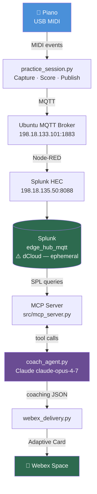
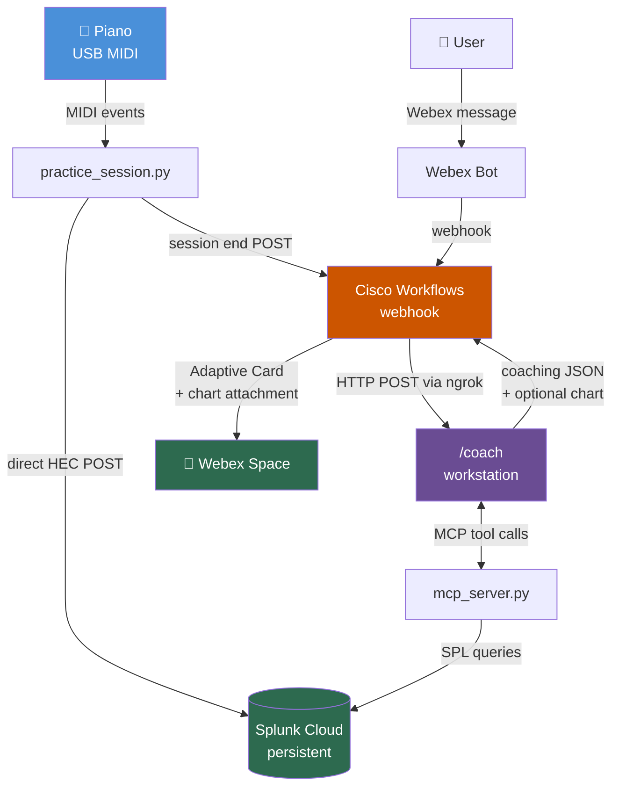

# AI Music Project — Implementation Plan
*Last updated: April 19, 2026*

> **v1 of this plan is archived at `plan/implementation_plan_v1_archived_2026-04-18.md`.** That version documents the original Cloud Run + Google Cloud architecture. The pivot from v1 to this version is documented in `notes/2026-04-19_architecture-pivot.md`.

---

## Project Purpose

Two goals running in parallel:

1. **Learning lab** — use piano practice as a hands-on way to build skills across MIDI, data pipelines, AI APIs, MCP, agents, and automation platforms simultaneously.
2. **Presentation foundation** — demonstrate that personal interests are a powerful way to develop AI/data skills that transfer directly to work. The premise: *"I used my piano practice as a sensor network. Same patterns I use at work — I just learned them at home first."*

The tool choices (MIDI, MQTT, Splunk, Cisco Workflows, Claude, MCP, Webex) are deliberately varied for breadth of learning, not just engineering efficiency.

**Presentations this serves:**
- AI music / hobby-as-AI-lab demo
- Cisco Workflows standalone presentation (this project is the live demo use case)

---

## Architecture Overview

### What's Working Now (April 2026)



**Trigger (manual today):** `op run --env-file=.env.tpl -- python src/coach_agent.py`

---

### Target Architecture (April 30 prototype)



**Key design decisions:**
- Workstation is the MIDI ingress point — all compute stays local until that changes
- Workflows is the cloud meeting point: receives webhooks from Splunk alerts and Webex bot, routes to `/coach` via ngrok, posts results back to Webex
- Workflows fits naturally as the Webex bot webhook receiver — it's a cloud endpoint by design, no extra infrastructure needed
- ngrok exposes one endpoint: the local `/coach` service
- Cloud Run (v1 plan) is parked but not deleted — reusable if MIDI moves off the workstation

---

## What Is Already Built ✅

### `src/mcp_server.py` — COMPLETE
Five MCP tools exposing Splunk practice data to Claude: `get_recent_sessions`, `get_session_detail`, `get_finger_trends`, `compare_hands`, `get_scale_history`. Confirmed working against live Splunk data.

### `src/coach_agent.py` — COMPLETE
Agentic Claude loop (claude-opus-4-7). Autonomously makes 4–6 tool calls, analyzes longitudinal trends, returns structured JSON coaching report. Tested live — correctly identified a 286 BPM milestone and segment-level fatigue pattern.

### `src/webex_delivery.py` — COMPLETE
Builds and posts a Webex Adaptive Card v1.2. Color-coded trend indicator, bullet lists, milestone callout. Confirmed rendering in Webex desktop client.

### `src/cloud_run_app.py` — PARKED (not deleted)
Flask `/coach` endpoint wrapping `run_coach()`. Originally deployed to Cloud Run. Kept as reference — the local `/coach` service will be derived from this.

### `src/practice_session.py` + `src/mqtt_publisher.py` — COMPLETE
Structured scale capture, scoring (speed/evenness/per-finger), MQTT publishing.

### `.env.tpl` + 1Password integration — COMPLETE
All secrets injected at runtime via `op run --env-file=.env.tpl`. Nothing sensitive on disk or in git.

---

## Prerequisite: Persistent Cloud Splunk

**This must be resolved before building anything else.** The longitudinal coaching value — "your ring finger has been consistently late for 3 weeks" — requires months of history. dCloud rotates weekly and wipes all data.

**Options:**

| Option | Cost | Ingest | Notes |
|--------|------|--------|-------|
| Splunk Cloud free trial | Free 14 days, ~$150/mo after | Full | Cleanest path, cloud-accessible immediately |
| Splunk Free on GCP VM | ~$10–20/mo (VM cost) | 500MB/day | Persistent, reachable from internet, free forever |
| Keep dCloud + export data | Free | — | Manual, breaks the automation story |

**Decision pending.** Resolve this first.

---

## Remaining Work — April 30 Prototype

### Priority order

#### P1 — Cloud Splunk
Get a persistent, internet-accessible Splunk instance. Update `SPLUNK_URL` and `SPLUNK_TOKEN` in 1Password. Confirm MCP tools connect.

#### P2 — HEC Publisher (bypass Node-RED)
Build `src/hec_publisher.py` — post directly to Splunk HEC from `practice_session.py`, eliminating the Node-RED → Ubuntu broker dependency. Eliminates manual setup on every lab rotation.

**Interface:** Same as `MQTTPublisher` (`publish_note`, `publish_segment`). Controlled by env var so MQTT path can be retained if needed.

#### P3 — ngrok Setup
- Install ngrok, configure fixed subdomain (paid tier — required for a stable Workflows webhook URL)
- Expose local `/coach` service
- Store the stable ngrok URL in 1Password as `NGROK_COACH_URL`
- Add `X-Coach-Token` auth header validation to `/coach` before exposing publicly

#### P4 — Local `/coach` Service
Adapt `src/cloud_run_app.py` to run as a local persistent service (not on Cloud Run). Two modes:

**Mode 1 — Session trigger:**
```json
POST /coach
{ "session_id": "...", "metrics": { ... } }
```
Runs the full agentic coaching loop. Returns structured JSON.

**Mode 2 — Freeform query:**
```json
POST /coach
{ "query": "How am I doing with my thumb crossover on ascending A major?" }
```
Claude interprets the query, decides which MCP tools to call, returns a response JSON. Optionally includes a chart (see P6).

Both modes return the same Adaptive Card-compatible JSON schema.

Consider: wire `run_coach()` call into `practice_session.py` at session end as a fallback trigger (no Workflows dependency for local testing).

#### P5 — Cisco Workflows: Session Trigger Flow

**Workflow 1 — Post-session coaching:**
```
Trigger: HTTP webhook (POST from practice_session.py at session end)
  → Extract session_id and metrics from payload
  → HTTP POST to ngrok /coach  { session_id, metrics }  [with X-Coach-Token header]
  → Parse JSON response
  → Condition: trend == "needs_attention" → red card, else green
  → Send Webex Adaptive Card
```

#### P6 — Webex Bot + Workflows: Freeform Query Flow

**Setup:**
1. Register Webex bot at developer.webex.com → "Piano Coach"
2. Configure Webex bot webhook → points to Workflows trigger URL
3. Workflows receives Webex webhook (message text + sender)

**Workflow 2 — Freeform query:**
```
Trigger: Webex bot message webhook
  → Extract message text
  → HTTP POST to ngrok /coach  { query: "<message text>" }  [with X-Coach-Token]
  → Parse JSON response
  → If response includes chart_url → attach image to card
  → Send Webex Adaptive Card reply
```

**Example queries the bot should handle:**
- "How am I doing with my A scale?"
- "Show me my progress over the last two weeks"
- "What's going on with my thumb crossover when ascending?" *(thumb tucks under after finger 3 — a known weak point)*
- "Which scale has improved the most?"

#### P7 — Chart/Graph Generation

Where appropriate, `/coach` can generate a chart and include it in the response. Charts that show well:
- Speed trend over time (BPM per scale, multiple lines)
- Evenness improvement curve (lower CV% = better)
- Per-finger timing deviation heatmap

**Implementation approach (TBD):**
- Option A: Generate PNG locally (matplotlib), save to temp file, attach to Webex message via bot API
- Option B: Generate an image URL (e.g. upload to GCS bucket) and include in Adaptive Card as `Image` element

Chart generation is optional for the April 30 prototype — include if time allows, omit if it creates risk to the deadline.

#### P8 — Pre-record Demo Sessions

Once the pipeline is stable, record 5–10 real practice sessions:
- Multiple scales (C, G, F, A major minimum)
- Visible improvement arc across sessions
- At least one session with a clear weak finger
- At least one session with a thumb-crossover timing anomaly

This data drives all demo recordings.

---

## April 30 Prototype Scope

**Must work (for recording):**
- [ ] Cloud Splunk receiving live practice data
- [ ] `practice_session.py` → HEC direct (no Node-RED)
- [ ] Session end → Workflows → `/coach` → Webex Adaptive Card
- [ ] Webex bot freeform query → Workflows → `/coach` → Webex card reply
- [ ] At least one example query showing trend data

**Nice to have:**
- [ ] Chart/graph in at least one response
- [ ] Thumb-crossover specific analysis working
- [ ] Weekly summary workflow

**Not required for April 30:**
- Splunk alert as the session trigger (practice_session.py direct POST is fine)
- Chart generation (include only if it doesn't risk the deadline)
- MCP server for Cisco Workflows (inverted control flow — still under consideration, deferred)

---

## Future Architecture (post-presentation)

Once MIDI is liberated from the workstation (Bluetooth MIDI / phone app):
- Workstation dependency drops
- Move `/coach` to Cloud Run or similar
- ngrok tunnels eliminated
- Workflows webhook URL becomes a stable Cloud Run URL

**Phase 4 (post-presentation):**
- Chord detection using `music21`
- Piano roll with chord labels
- Training dataset from recordings
- Live call-and-response AI via Reaper/Pianoteq

---

## Open Issues / Decisions Pending

- **Cloud Splunk** — which option? Must decide this week.
- **ngrok tier** — free (changing URL) vs paid (fixed subdomain). Fixed is required for a stable Workflows webhook URL.
- **Chart delivery** — local PNG via bot API, or GCS-hosted URL in Adaptive Card?
- **`get_finger_trends` SPL fix** — IOI-based deviation rewrite still deferred. Current implementation returns misleading values for fingers late in the scale. Fix before demo recording.

---

## Implementation Notes

### MCP Server tool status (April 18, 2026)

| Tool | Status | Notes |
|------|--------|-------|
| `get_recent_sessions` | ✅ Working | All fields correct |
| `compare_hands` | ✅ Working | All fields correct |
| `get_scale_history` | ✅ Working | All fields correct |
| `get_session_detail` | ✅ Working | `finger: null` on early sessions — data issue, not a code bug |
| `get_finger_trends` | ⚠️ Needs fix | Deviation values not meaningful — uses cumulative time vs. session mean. Fix: compute IOI-based deviation within each segment. Defer until after core pipeline works. |

### Node-RED dependency (to be eliminated in P2)

Current path routes through Node-RED on the Ubuntu broker. Must be rebuilt manually on every dCloud rotation. HEC publisher will eliminate this entirely.

### 1Password secrets (all working)

| Secret | 1Password item |
|--------|---------------|
| `ANTHROPIC_API_KEY` | Private vault |
| `SPLUNK_URL` | Private vault |
| `SPLUNK_TOKEN` | Private vault |
| `WEBEX_BOT_TOKEN` | Private vault |
| `NGROK_COACH_URL` | Add when ngrok is configured |
| `COACH_TOKEN` | Add when `/coach` auth is implemented |

Run with: `op run --env-file=.env.tpl -- python src/<script>.py`
