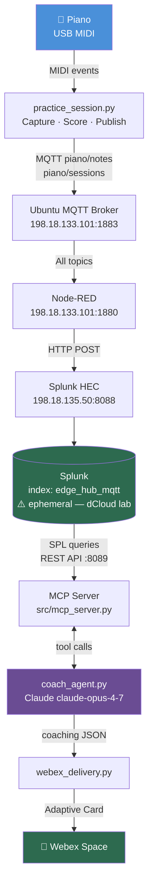
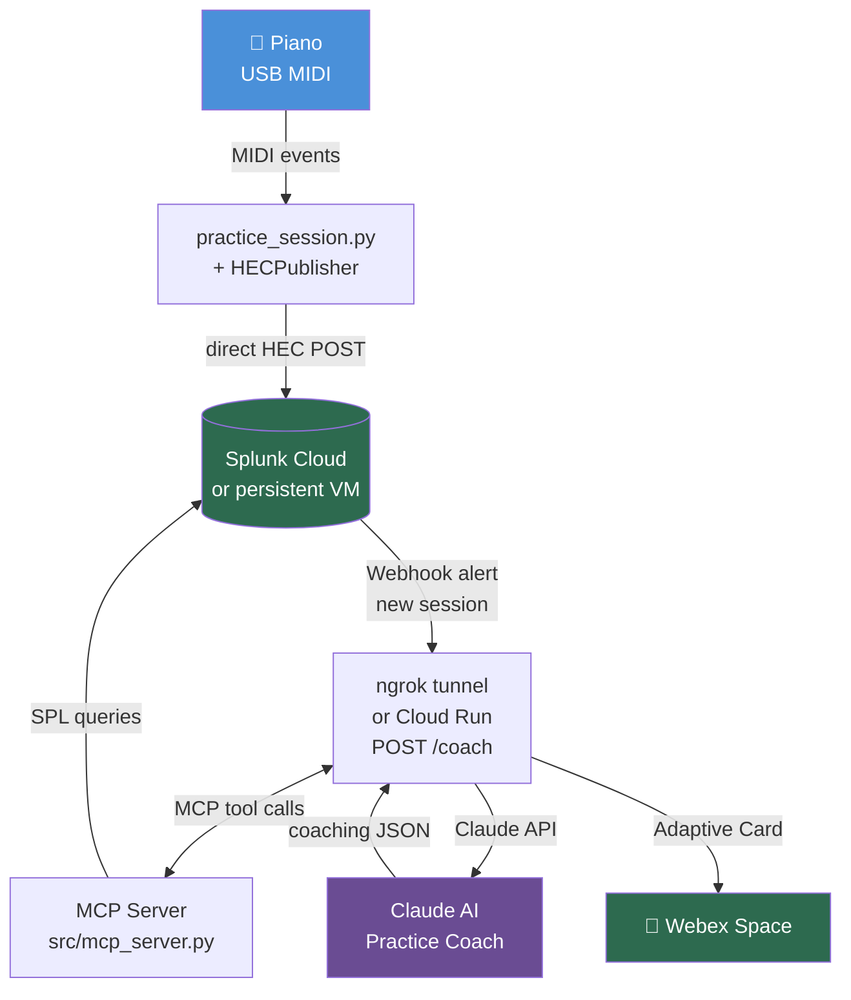

# AI Music Project — Implementation Plan
*Last updated: April 18, 2026 (evening)*

---

## Project Purpose

Two goals running in parallel:

1. **Learning lab** — use piano practice as a hands-on way to build skills across MIDI, data pipelines, AI APIs, MCP, agents, and automation platforms simultaneously.
2. **Presentation foundation** — demonstrate that personal interests are a powerful way to develop AI/data skills that transfer directly to work. The premise: *"I used my piano practice as a sensor network. Same patterns I use at work — I just learned them at home first."*

The tool choices (MIDI, MQTT, Splunk, Cisco Workflows, Claude, MCP, Webex) are deliberately varied for breadth of learning, not just engineering efficiency.

**Presentations this serves:**
- AI music / hobby-as-AI-lab demo
- Cisco Workflows standalone presentation (this project is the live demo use case)
- The Workflows demo itself may also be included as part of the main presentation

---

## Architecture Overview

### Current working architecture (April 2026)



**Trigger (manual today):** `op run --env-file=.env.tpl -- python src/coach_agent.py`

### Target architecture (once Splunk is cloud-hosted)



---

## What Is Already Built

### `src/mcp_server.py` — COMPLETE ✅
Five MCP tools exposing Splunk practice data to Claude: `get_recent_sessions`, `get_session_detail`, `get_finger_trends`, `compare_hands`, `get_scale_history`. All confirmed working against live Splunk data. See `notes/2026-04-18_mcp-server-and-coach-agent.md`.

### `src/coach_agent.py` — COMPLETE ✅
Agentic Claude loop (claude-opus-4-7). Autonomously makes 4-6 tool calls, analyzes longitudinal trends, and returns a structured JSON coaching report. Tested live — correctly identified a 286 BPM milestone and segment-level fatigue pattern. See `notes/2026-04-18_mcp-server-and-coach-agent.md`.

### `src/webex_delivery.py` — COMPLETE ✅
Builds and posts a Webex Adaptive Card v1.2. Color-coded trend indicator, bullet lists, milestone callout. Confirmed rendering correctly in Webex desktop client. See `notes/2026-04-18_webex-delivery.md`.

### `src/cloud_run_app.py` — DEPLOYED ✅ (trigger path pending)
Flask endpoint wrapping `run_coach()`. Deployed to Cloud Run at:
`https://piano-coach-du77rapgfq-uc.a.run.app`
Handles both manual POST `{"session_id": "..."}` and Splunk alert webhook format.
**Note:** Cloud Run cannot reach dCloud private IPs (198.18.x.x). Automatic trigger from Splunk alert is deferred until Splunk moves to cloud infrastructure. See implementation notes below.

### `.env.tpl` + 1Password integration — COMPLETE ✅
All secrets (Anthropic, Splunk, Webex) stored in 1Password Private vault, injected via `op run --env-file=.env.tpl`. Nothing sensitive on disk or in git. See `notes/2026-04-18_1password-secrets.md`.

### `src/midi_test.py` — COMPLETE ✅
Simple proof-of-concept. Opens the first MIDI port, listens for events, prints NOTE ON / NOTE OFF with note names and velocities to the terminal. No file output. Used to verify Python can hear the piano.

**To run:**
```bash
cd "c:\Users\jpbar\My Drive\Technical Projects\ai-music-project"
.venv\Scripts\activate
python src/midi_test.py
# Press Ctrl+C to stop
```

### `src/piano_roll.py` — COMPLETE
Full Phase 1 pipeline. Records MIDI for a set duration (default 15s), saves a `.mid` file, then renders a dark-themed piano roll PNG showing notes by pitch and time, coloured by key type (blue = white keys, pink = black keys), brightness scaled to velocity.

**To run:**
```bash
cd "c:\Users\jpbar\My Drive\Technical Projects\ai-music-project"
.venv\Scripts\activate
python src/piano_roll.py
# Play for 15 seconds — outputs data/recording.mid and data/recording_roll.png
```

**Output files** (in `data/`, gitignored):
- `data/recording.mid` — raw MIDI file
- `data/recording_roll.png` — piano roll image

### Infrastructure
- `reapy-next` patched for Python 3.13 — Reaper bridge confirmed working
- Patch documented in `notes/Reapy_Patch_Notes.md`, automated via `patch_reapy.bat`

---

## Phase 3 — AI Practice Coach (ACTIVE)
*Target: ~2 weeks from April 2026*

### 3.1 — Structured Scale Practice Capture
**Goal:** Replace free-form recording with structured, scoreable practice sessions.

**What to build** (`src/practice_session.py`):
- Define finger-to-note mappings per scale (e.g. C major: thumb=C, index=D, middle=E, ring=F, pinky=G, etc. — both hands)
- Accept a practice config at runtime: which scale, which hand
- Capture raw MIDI with high-precision timestamps
- Compute per-session metrics:
  - **Speed** — average BPM across the scale run
  - **Evenness** — timing variance between consecutive notes (std dev of inter-note intervals)
  - **Per-finger analysis** — map each note back to its expected finger, flag timing outliers
- Output: structured JSON session summary + raw `.mid` file

*Deferred to Phase 4: articulation modes (legato/staccato)*

### 3.2 — MQTT Publisher
**Goal:** Send session data to Splunk via MQTT in real time (or on session completion).

**What to build** (`src/mqtt_publisher.py`):
- Connect to local MQTT broker (or Splunk Edge Hub directly if it supports direct MQTT)
- Two message types:
  - **Raw note events** — one MQTT message per NOTE_ON/NOTE_OFF, published during session
  - **Session summary** — one structured JSON message at session end (speed, evenness, finger scores)
- Topic structure e.g.: `piano/notes/raw`, `piano/session/summary`

**Dependencies to add:** `paho-mqtt`

### 3.3 — Splunk Configuration
**Goal:** Ingest MQTT data into Splunk, build SPL queries for analysis.

**Steps:**
- Configure Splunk Edge Hub MQTT input (topics: `piano/#`)
- Define two sourcetypes: `piano:note` and `piano:session`
- Write SPL to:
  - Surface session scores over time (trending)
  - Identify weakest finger per scale
  - Compare left hand vs. right hand evenness

**Progress-over-time queries (priority):**
The longitudinal view is the most compelling story — a single session is data, but a trend is insight. Build these SPL queries as saved searches and dashboard panels:

```spl
-- Speed trend per scale over time
index=edge_hub_mqtt source="piano/sessions"
| eval scale=json_extract(event, "scale_display")
| eval rh_bpm=json_extract(event, "metrics.right.speed_bpm")
| timechart avg(rh_bpm) by scale

-- Evenness improvement over time (lower = better)
index=edge_hub_mqtt source="piano/sessions"
| eval cv=json_extract(event, "metrics.right.evenness_cv_pct")
| timechart avg(cv)

-- Per-finger timing deviation trend (which fingers are getting better?)
index=edge_hub_mqtt source="piano/notes"
| eval finger=json_extract(event, "finger")
| eval time_ms=json_extract(event, "time_ms")
| stats avg(time_ms) as avg_timing, stdev(time_ms) as timing_stdev by finger, date_hour
| timechart avg(timing_stdev) by finger
```

*Note: the `json_extract()` queries above require sufficient data spread across multiple time buckets to produce a trend. Use the `spath` queries below for early-stage data (fewer than ~20 sessions or all recorded in the same day).*

**Working queries — confirmed with live data:**

Splunk auto-extracts top-level JSON fields from HEC events. Nested fields (under `metrics.*`) require `spath`. Use `stats` instead of `timechart` until data spans multiple days.

```spl
-- Speed per scale (works immediately, any amount of data)
index=edge_hub_mqtt source="piano/sessions"
| spath input=event output=scale path=scale_display
| spath input=event output=rh_bpm path=metrics.right.speed_bpm
| stats avg(rh_bpm) as avg_bpm by scale

-- Evenness per session — sortable timeline (one row per session)
index=edge_hub_mqtt source="piano/sessions"
| spath input=event output=cv path=metrics.right.evenness_cv_pct
| spath input=event output=scale path=scale_display
| spath input=event output=seg path=segment_index
| table _time, scale, seg, cv
| sort _time

-- Raw field discovery — run on one event to confirm all available field names
index=edge_hub_mqtt source="piano/sessions"
| head 1
| spath input=event
| table *
```

**Future use case note:** Once enough sessions are recorded (20+), consider exporting the longitudinal dataset to train a simple regression model predicting which finger will be weak on a given scale based on early-session note timing — a natural Phase 4 ML exercise using the same Splunk data.

### 3.4 — AI Coaching Pipeline (Workflows + MCP + Claude + Webex)

**Goal:** Automate the full coaching loop — a new practice session triggers an agentic AI analysis delivered as a Webex Adaptive Card.

**Key design decisions:**
- Workflows orchestrates but does not analyze — it delegates to Claude
- Claude acts as a true agent: it receives a trigger, autonomously queries Splunk via MCP tools to build context, then generates coaching feedback
- `/coach` returns a plain HTTP JSON response — Workflows reads it synchronously, no callback needed
- Claude is the coaching model (analytical depth); Gemini assists with generating Cloud Run infrastructure code from the design spec below
- Webex Adaptive Card is the sole output — visually compelling for a Cisco-ecosystem presentation

---

#### 3.4.1 — Splunk Alert → Cloud Run Trigger

**What:** Splunk webhook alert fires when a new `piano/sessions` event arrives in `edge_hub_mqtt`.

**How:**
- In Splunk: **Alerts → Create Alert** → search `index=edge_hub_mqtt source="piano/sessions"` → trigger when results > 0 → webhook action → POST to Cloud Run `/trigger`
- Cloud Run `/trigger` receives the payload, extracts `session_id`, calls Cisco Workflows API to start the session workflow

**Files:** `cloud/main.py` — Flask/FastAPI app with `/trigger` and `/coach` routes

---

#### 3.4.2 — MCP Server (`src/mcp_server.py`)

**What:** Python MCP server exposing Splunk as callable tools for Claude.

**Tools to expose:**

| Tool | Arguments | Returns |
|------|-----------|---------|
| `get_recent_sessions` | `count: int` | Last N session summaries (scale, speed, evenness, segment_index) |
| `get_session_detail` | `session_id: str` | Full note-level data for one session |
| `get_finger_trends` | `scale: str, hand: str, sessions_back: int` | Per-finger timing history across sessions |
| `compare_hands` | `session_id: str` | LH vs RH speed and evenness delta for a session |
| `get_scale_history` | `scale: str` | Speed and evenness trend over all sessions for a scale |

**Implementation:** Uses `mcp` Python SDK. Each tool runs a SPL query against the Splunk REST API (`https://198.18.135.50:8089/services/search/jobs`) and returns structured JSON.

**Hosting:** Same Cloud Run container as the trigger/coach routes, started as a subprocess or sidecar.

---

#### 3.4.3 — Claude AI Agent (`src/coach_agent.py`)

**What:** Agentic Claude session — Claude autonomously decides what to look up before generating coaching feedback.

**How it works:**
1. Receives `session_id` and current session metrics
2. Claude is initialized with a coaching system prompt (see below)
3. Claude decides which MCP tools to call (e.g. pulls last 5 sessions, checks finger trends for weak fingers, compares hands)
4. After gathering context, Claude writes a structured coaching report
5. Returns JSON to the `/coach` route, which returns it as an HTTP 200 response to Workflows

**System prompt:**
```
You are an expert piano practice coach analyzing a student's scale practice data.
You have access to tools that query the student's full practice history in Splunk.
When given a new session, autonomously investigate the data to build context:
- Check recent session trends (improving, plateauing, declining?)
- Identify the weakest finger(s) based on timing deviation
- Compare left and right hand consistency
- Note any scale-specific patterns

The most important thing to communicate is **progress over time** — not just how today went,
but whether the student is measurably improving across sessions. If you can say "your right
hand evenness has improved 23% over the last 5 sessions" or "finger 4 has been consistently
late for 3 weeks", that is far more valuable than a single-session snapshot.

Return a JSON object with these fields:
{
  "summary": "2-3 sentence overall assessment including trend context",
  "strengths": ["list of what went well, with comparison to prior sessions where possible"],
  "focus_areas": ["list of specific things to work on, with finger numbers and trend context"],
  "suggested_next_session": "one concrete practice instruction",
  "trend": "improving | stable | needs_attention",
  "trend_detail": "1-2 sentences on the specific metric driving the trend assessment",
  "milestone": "optional — call out if a personal best was set this session"
}
```

---

#### 3.4.4 — Cisco Workflows

**Two workflows to build:**

**Workflow 1 — Session Coaching** (triggered by Cloud Run `/trigger`):
```
Trigger: HTTP webhook (from Cloud Run)
  → Extract session_id from payload
  → HTTP POST to Cloud Run /coach  {session_id: ..., metrics: ...}
  → Parse JSON response (summary, strengths, focus_areas, trend)
  → Condition: if trend == "needs_attention" → set card color red, else green
  → Send Webex Adaptive Card to bot space
```

**Workflow 2 — Weekly Summary** (scheduled, optional):
```
Trigger: Schedule (Sunday evening)
  → HTTP POST to Cloud Run /coach  {mode: "weekly_summary"}
  → Claude aggregates the week's sessions
  → Send weekly progress card to Webex
```

**Workflows AI Assistant prompt** (paste this into the AI Assistant in the Workflows UI):

> Create a workflow that is triggered by an incoming webhook. The webhook payload contains a JSON body with fields `session_id` (string) and `metrics` (object). The workflow should make an HTTP POST request to an external API endpoint `/coach` passing the full webhook payload as the request body, with Content-Type application/json. The response will be a JSON object with fields: `summary` (string), `strengths` (array of strings), `focus_areas` (array of strings), `suggested_next_session` (string), and `trend` (string, one of: improving, stable, needs_attention). After receiving the response, send a Webex message to a space using a bot. The message should be an Adaptive Card showing the summary text prominently, the strengths and focus areas as bullet lists, and the suggested next session as a highlighted action item. If the trend field equals "needs_attention", set the card's accent color to red; otherwise use green.

---

#### 3.4.5 — Webex Bot + Adaptive Cards

**Setup:**
1. Register a bot at [developer.webex.com](https://developer.webex.com) → name it "Piano Coach"
2. Add the bot to a personal Webex space
3. Store the bot token in Cloud Run environment variables

**Adaptive Card design:**

```json
{
  "type": "AdaptiveCard",
  "body": [
    { "type": "TextBlock", "text": "🎹 Practice Session Complete", "size": "Large", "weight": "Bolder" },
    { "type": "TextBlock", "text": "{{summary}}", "wrap": true },
    { "type": "TextBlock", "text": "✅ Strengths", "weight": "Bolder" },
    { "type": "TextBlock", "text": "{{strengths_bullets}}", "wrap": true },
    { "type": "TextBlock", "text": "🎯 Focus Areas", "weight": "Bolder" },
    { "type": "TextBlock", "text": "{{focus_bullets}}", "wrap": true },
    { "type": "TextBlock", "text": "Next session: {{suggested_next_session}}",
      "wrap": true, "color": "Accent" }
  ]
}
```

---

#### 3.4.6 — Google Cloud Run Infrastructure

**Design spec for Gemini** (paste into Gemini to generate the Cloud Run service):

> Build a Python FastAPI application for Google Cloud Run with the following two routes:
>
> **POST /trigger** — receives a Splunk webhook alert payload (JSON), extracts the `result.session_id` field, then makes an HTTP POST request to a Cisco Workflows webhook URL (stored in environment variable `WORKFLOWS_WEBHOOK_URL`) with body `{"session_id": "<extracted_id>"}`. Returns 200 OK.
>
> **POST /coach** — receives a JSON body with `session_id` (string) and `metrics` (object). Initializes an Anthropic Claude client (API key from env var `ANTHROPIC_API_KEY`) and runs an agentic loop: Claude is given a system prompt as a piano practice coach and has access to MCP tools that query Splunk (Splunk base URL from env var `SPLUNK_URL`, token from `SPLUNK_TOKEN`). The MCP tools are: `get_recent_sessions(count)`, `get_session_detail(session_id)`, `get_finger_trends(scale, hand, sessions_back)`, `compare_hands(session_id)`. Run the agent loop until Claude returns a final answer (no more tool calls). Parse the final answer as JSON and return it as the HTTP response body with status 200.
>
> Include a Dockerfile. Use `google-cloud-run` deploy instructions in the README. Required environment variables: `ANTHROPIC_API_KEY`, `SPLUNK_URL`, `SPLUNK_TOKEN`, `WORKFLOWS_WEBHOOK_URL`, `WEBEX_BOT_TOKEN`.

**Environment variables to configure in Cloud Run:**

| Variable | Value |
|----------|-------|
| `ANTHROPIC_API_KEY` | From console.anthropic.com |
| `SPLUNK_URL` | `https://198.18.135.50:8089` |
| `SPLUNK_TOKEN` | Splunk API token (create in Splunk Settings) |
| `WORKFLOWS_WEBHOOK_URL` | From Cisco Workflows trigger config |
| `WEBEX_BOT_TOKEN` | From developer.webex.com bot registration |

### 3.5 — Pre-record Demo Data

With the pipeline complete, record 5-10 real practice sessions covering:
- Multiple scales (C, G, F major minimum)
- Visible improvement arc across sessions (speeds up, evenness improves)
- At least one session with a clear weak finger to demonstrate coaching specificity

This data drives the live Splunk dashboard and generates real Claude coaching cards for the presentation.

---

## Phase 4 — Future (post-presentation)

Original goals, deferred until after the presentation:

- **Chord detection** using `music21` — identify chords from free-play recordings
- **Label piano roll visualizations** with chord names
- **Build a training dataset** from multiple recordings
- **Train an AI model** on personal playing data
- **Live call-and-response** — AI generates musical responses routed through Reaper/Pianoteq via Claude MCP (requires keyboard present at demo)

---

## Open Questions / Under Consideration

- **MCP server for Cisco Workflows** — would let Claude *trigger* workflows as a tool (inverts control flow). Interesting but unclear presentation value — revisit when scope is locked.
- **Webex vs. web dashboard** — or both. Webex is more Cisco-native and demo-friendly.
- **MQTT broker** — resolved: Ubuntu broker at 198.18.133.101 via Node-RED is the production path. Splunk Edge Hub is optional.

## Implementation Notes (running log)

### MCP Server — tool status as of April 18, 2026

All five tools connect to Splunk and return data. Confirmed against live session data.

| Tool | Status | Notes |
|------|--------|-------|
| `get_recent_sessions` | ✅ Working | All fields correct |
| `compare_hands` | ✅ Working | All fields correct after adding `_time`, `session_id`, `scale` to table |
| `get_scale_history` | ✅ Working | All fields correct after adding `scale`, `scale_display` to table |
| `get_session_detail` | ✅ Working | `finger: null` on early sessions is a data issue — scale detection hadn't locked in yet, not a code bug |
| `get_finger_trends` | ⚠️ Needs improvement | Returns data but deviation values are not meaningful. Current approach computes each note's deviation from the session-wide mean `time_ms` (cumulative time since session start). Fingers appearing later in the scale (4, 5) will always show negative deviation against the global mean — this is an artifact of scale position, not actual timing weakness. Correct fix: compute inter-onset intervals within each segment and measure per-finger deviation from the expected IOI. Complex SPL — defer to after core pipeline is working. |

### Node-RED dependency — should be eliminated

**Current path:** `practice_session.py` → MQTT → Ubuntu broker → Node-RED → Splunk HEC

**Problem:** Node-RED requires manual configuration each time the dCloud lab session is rotated (weekly). The `piano/#` flow and HTTP POST node must be rebuilt from scratch in the new lab instance. This is friction that will break the demo setup cadence.

**Recommended fix:** Post directly to Splunk HEC from `practice_session.py` and `mqtt_publisher.py`, bypassing Node-RED and the MQTT broker entirely for Splunk ingestion. The HEC endpoint (`https://198.18.135.50:8089`) and token are already confirmed working from the PC.

**Proposed new path:** `practice_session.py` → HEC POST (direct) → Splunk

**Implementation:** Add a `HECPublisher` class to `src/` alongside `MQTTPublisher`. Same interface (`publish_note`, `publish_segment`), but POSTs directly to HEC rather than publishing to MQTT. `practice_session.py` instantiates both (or either, controlled by env var) so MQTT can be retained if needed for other consumers.

**What this eliminates:** Node-RED piano flow, Ubuntu broker dependency for Splunk ingestion, manual Node-RED setup on lab rotation.

**What this does NOT affect:** The Ubuntu broker still exists in the lab for Meraki device data. We just stop routing our data through it.

**Lab rotation checklist (target state — after HEC publisher is built):**
- Set `SPLUNK_TOKEN` (from 1Password)
- Set `SPLUNK_URL` (static: `https://198.18.135.50:8089`)
- Set `ANTHROPIC_API_KEY` (from 1Password)
- Run `practice_session.py` — everything else is automatic

### Cloud Run — network boundary discovery (April 18, 2026)

Cloud Run was successfully deployed and the service is live. However, when triggered it times
out trying to reach Splunk at `198.18.135.50:8089`. Root cause: Cloud Run runs on GCP's public
network and has no route to the dCloud private lab IPs. The user's PC can reach these IPs via a
static route, but GCP cannot.

**Decision:** Keep Cloud Run deployed (costs nothing at rest). Defer it as the primary trigger
path until Splunk is on cloud infrastructure. Use local trigger (Option A) in the meantime.

**Rejected alternatives:**
- Splunk pushing full session data in the webhook payload — loses multi-session history queries
- VPN from GCP to dCloud — too complex for a lab demo
- Cloudflare Tunnel — competitively awkward for a Cisco conference presentation

**Path forward:**
1. Short term: auto-trigger `run_coach()` from `practice_session.py` at session end (local, reliable)
2. Medium term: move to persistent Splunk (Cloud trial or GCP VM). Once Splunk is reachable from
   the internet, Cloud Run + Splunk alert webhook becomes the clean automated trigger.
3. For webhook auth: add `X-Coach-Token` header check to `/coach` to prevent unauthorized API use.
   Splunk alert config sends the header; Cloud Run validates it against a Secret Manager value.
4. Tunnel option: ngrok is the preferred choice for Cisco conference context (competitively neutral).
   Add a fixed subdomain (ngrok paid tier) for a stable webhook URL.

### Data persistence — the blocking issue

dCloud lab sessions rotate weekly, wiping all Splunk data. The longitudinal coaching analysis
(the core value prop) requires months of history. Building cloud infrastructure on top of
ephemeral Splunk is premature.

**Options under consideration:**
- **Splunk Cloud free trial** (14 days, then ~$150/mo) — full-featured, cloud-accessible, cleanest path
- **Splunk Free on a GCP VM** (500MB/day ingest, free forever) — persistent, reachable from Cloud Run
- **Alternative time-series store** (InfluxDB, BigQuery) — would require rewriting MCP tools

**Decision pending.** Resolve this before investing further in the automated trigger pipeline.

---

## Future Work / Backlog

- **HEC publisher** (`src/hec_publisher.py`) — bypass Node-RED, post directly to Splunk HEC. Eliminates manual Node-RED setup on lab rotation. See implementation note above.

- **1Password secrets integration** — API keys (Anthropic, Webex bot token, Splunk token) must not be written to disk unencrypted. Integrate with 1Password CLI (`op run --env-file`) so all secrets are injected at runtime from the 1Password vault. This applies to both local development (`.env` equivalent via `op run`) and Cloud Run (secret manager or `op` sidecar). Treat this as a prerequisite before any API keys are committed or stored in Cloud Run env vars in plaintext.
  - Reference: `op run -- python src/coach_agent.py` injects secrets from a reference file without touching disk
  - Cloud Run alternative: Google Secret Manager (native integration, no 1Password dependency in prod)

- **`get_finger_trends` SPL fix** — rewrite to compute IOI-based deviation within each segment rather than deviation from cumulative session time. See MCP tool status note above.

- **Longitudinal ML model (Phase 4)** — once 20+ sessions exist, train a simple regression model predicting finger weakness from early-session timing data. Splunk dataset is already structured for this.

- **Splunk dashboard** — dedicated practice progress dashboard showing speed/evenness trends over time, per-finger heatmap, scale comparison. Natural companion to the Webex card output.

---

## Immediate Next Steps

**Completed as of April 18, 2026:**
- ✅ Structured practice capture (`practice_session.py`, `mqtt_publisher.py`)
- ✅ Node-RED → Splunk HEC pipeline confirmed with live data
- ✅ MCP server with 5 working Splunk tools
- ✅ Claude coaching agent — agentic loop, longitudinal analysis, JSON output
- ✅ Webex Adaptive Card delivery — confirmed rendering in client
- ✅ 1Password secrets integration
- ✅ Cloud Run deployed (trigger path deferred — network boundary issue)

**Next session priorities:**
1. **Decide on persistent Splunk** — Cloud trial vs GCP VM. This unblocks everything else.
2. **Wire `run_coach()` into `practice_session.py`** — auto-trigger coaching at session end (no manual command needed)
3. **Add `X-Coach-Token` auth to `/coach`** — before enabling any public webhook URL
4. **Build `src/hec_publisher.py`** — bypass Node-RED, post directly to Splunk HEC. Eliminates weekly lab rotation friction.
5. **Pre-record demo sessions** — once data pipeline is stable, record 5-10 sessions across multiple scales to build a compelling improvement arc for the presentation
