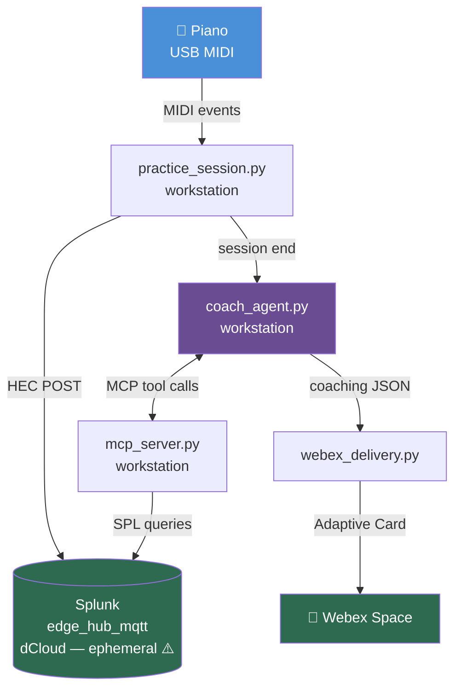
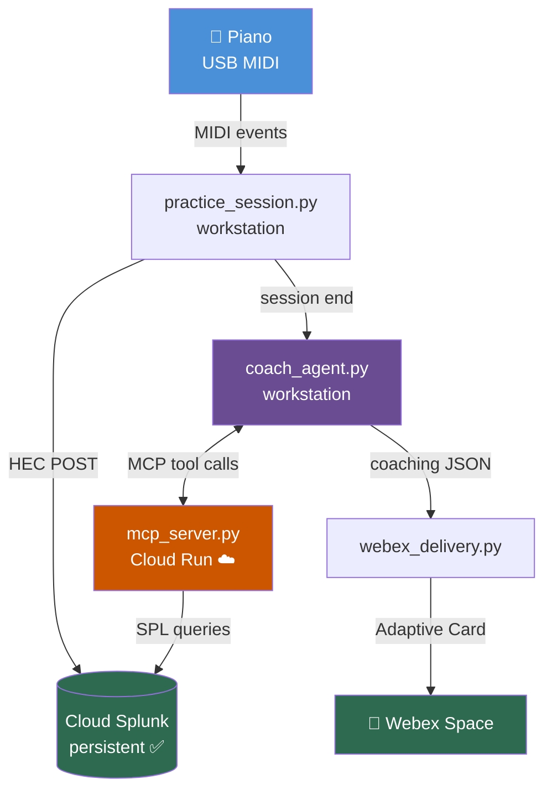
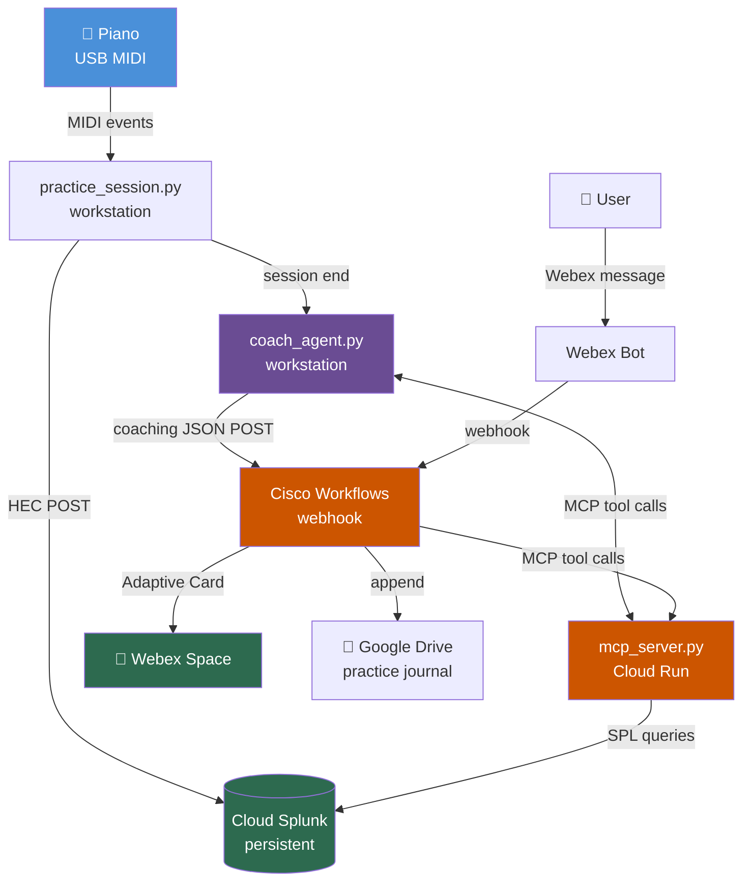

# AI Music Project — Implementation Plan
*Updated: April 25, 2026*

---

## Project Purpose

Two goals running in parallel:

1. **Learning lab** — use piano practice as a hands-on way to build skills across MIDI, data pipelines, AI APIs, MCP, agents, and automation platforms simultaneously.
2. **Presentation foundation** — demonstrate that personal interests are a powerful way to develop AI/data skills that transfer directly to work.

> *"I used my piano practice as a sensor network. Same patterns I use at work — I just learned them at home first."*

**Presentations this serves:**
- AI music / hobby-as-AI-lab demo
- Cisco Workflows standalone presentation (stretch goal — see Phase 1.5)

---

## What Is Already Built ✅

| Component | File | Status |
|-----------|------|--------|
| MIDI capture + scoring | `src/practice_session.py` | ✅ Complete |
| Direct Splunk HEC publisher | `src/hec_publisher.py` | ✅ Complete |
| MQTT publisher (fallback) | `src/mqtt_publisher.py` | ✅ Complete |
| MCP server (5 tools) | `src/mcp_server.py` | ✅ Complete |
| AI coach agent | `src/coach_agent.py` | ✅ Complete — tested live |
| Webex Adaptive Card delivery | `src/webex_delivery.py` | ✅ Complete — confirmed rendering |
| Session-end coach trigger | `src/practice_session.py` | ✅ Wired — untested end-to-end |
| Test scale simulator | `tools/send_test_scale.py` | ✅ Complete |
| MCP smoke test | `tools/test_mcp_tools.py` | ✅ Complete |

---

## Phase 1 — Core Pipeline (Local)
*Target: working prototype recorded by April 30, 2026*

### Architecture

```mermaid
flowchart TD
    A["🎹 Piano<br/>USB MIDI"] -->|MIDI events| B["practice_session.py<br/>workstation"]
    B -->|HEC POST| F[("Splunk<br/>edge_hub_mqtt<br/>dCloud — ephemeral ⚠️")]
    B -->|session end| C["coach_agent.py<br/>workstation"]
    C <-->|MCP tool calls| J["mcp_server.py<br/>workstation"]
    J -->|SPL queries| F
    C -->|coaching JSON| W["webex_delivery.py"]
    W -->|Adaptive Card| M["📱 Webex Space"]

    style A fill:#4a90d9,color:#fff
    style F fill:#2d6a4f,color:#fff
    style C fill:#6a4c93,color:#fff
    style M fill:#2d6a4f,color:#fff
```

Everything runs on the workstation. No tunnels. No cloud dependencies except Webex and the Claude API.

### Remaining Work

#### P1.1 — End-to-End Pipeline Test
- ✅ `tools/send_test_scale.py` → events confirmed in Splunk
- [ ] `tools/test_mcp_tools.py` → confirm MCP tools query Splunk correctly
- [ ] Full pipeline: play a scale → Webex coaching card arrives
- [ ] Fix `get_finger_trends` SPL deviation values (uses cumulative time vs. session mean — misleading; rewrite to use IOI-based deviation per segment)

#### P1.2 — Cloud Splunk
The longitudinal coaching story ("your ring finger has been consistently late for 3 weeks") requires persistent data. dCloud rotates weekly and wipes all history.

**Options:**
| Option | Cost | Notes |
|--------|------|-------|
| Splunk Cloud free trial | Free 14 days | Cleanest path, cloud-accessible immediately |
| Splunk Free on GCP VM | ~$10–20/mo | Persistent, internet-reachable, free tier forever |

**Decision pending.** Once resolved: update `SPLUNK_URL`, `SPLUNK_HEC_URL`, and their 1Password entries. Everything else unchanged.

#### P1.3 — Pre-Record Demo Sessions
Once pipeline is stable, record 5–10 real practice sessions:
- Multiple scales (C, G, F, A major minimum)
- Visible improvement arc across sessions
- At least one session with a clear weak finger
- At least one session with a thumb-crossover timing anomaly

---

> 📝 **Checkpoint — write a project state note after P1.1 end-to-end test passes.**
> Include: what's working, current architecture diagram, key technical elements with brief explanations. Save to `notes/` as `YYYY-MM-DD_state_phase1-complete.md`.

---

## Phase 1.5 — Stretch Goal: Webex Bot via Workflows
*Begin only if Phase 1 is stable with time to spare before April 30*

This is the one place Workflows genuinely fits: as a cloud webhook receiver for Webex bot messages. A user sends a freeform question to the Piano Coach bot in Webex → Workflows receives the webhook → POSTs to local `/coach` via ngrok → Claude runs the agentic loop → Workflows delivers the card reply.

**Why it fits:** Webex bot webhooks must land on a public cloud endpoint. Workflows is that by design.

**What it adds to the demo:** a live conversational moment — type a question, get a coaching card back. Contrasts with the automated end-of-session card.

**What it requires:**
- ngrok paid tier (fixed subdomain) — expose local `/coach` on port 8080
- Register Webex bot at developer.webex.com
- Local `/coach` Flask service — adapt `src/cloud_run_app.py`, add `X-Coach-Token` auth, add freeform query mode
- One Workflow: Webex bot webhook → extract message → POST to ngrok `/coach` → send card reply

**Example queries the bot should handle:**
- "How am I doing with my A scale?"
- "Which scale has improved the most?"
- "What's going on with my thumb crossover?"

---

## Phase 2 — Post-Draft-Presentation
*Begin after draft presentation submitted and Phase 1 demo is recorded*

### P2.1 — Cloud Splunk + Cloud MCP Server
*Do these together — the MCP server can only move to the cloud once Splunk is cloud-accessible.*

Move `src/mcp_server.py` to Cloud Run (already have the Dockerfile and Cloud Run familiarity from the earlier v1 architecture). `coach_agent.py` stays on the workstation — it's triggered by session end — but its MCP tools are now cloud-hosted and query cloud Splunk directly.

**Why this matters:**
- More realistic production architecture — tool servers don't run on laptops
- Good presentation talking point: MCP as a cloud service
- Creates a natural integration point for Workflows (Workflows can call MCP tools directly without needing ngrok or a local `/coach` service)

**Target architecture after P2.1:**

```mermaid
flowchart TD
    A["🎹 Piano<br/>USB MIDI"] -->|MIDI events| B["practice_session.py<br/>workstation"]
    B -->|HEC POST| F[("Cloud Splunk<br/>persistent ✅")]
    B -->|session end| C["coach_agent.py<br/>workstation"]
    C <-->|MCP tool calls| J["mcp_server.py<br/>Cloud Run ☁️"]
    J -->|SPL queries| F
    C -->|coaching JSON| W["webex_delivery.py"]
    W -->|Adaptive Card| M["📱 Webex Space"]

    style A fill:#4a90d9,color:#fff
    style F fill:#2d6a4f,color:#fff
    style C fill:#6a4c93,color:#fff
    style J fill:#cc5500,color:#fff
    style M fill:#2d6a4f,color:#fff
```

---

> 📝 **Checkpoint — write a project state note after P2.1 is working.**
> Include: what moved to cloud, why, architecture diagram, key technical elements. Save to `notes/` as `YYYY-MM-DD_state_cloud-mcp.md`.

---

### P2.2 — Claude Code Primitives Demo
Build concrete examples of all three Claude Code primitives as interactive coaching features:

- **Slash command** (`/analyze-session`) — runs full coaching analysis on the most recent session on demand
- **Skill** — a reusable packaged behavior, e.g. "scale compare" that contrasts two sessions side by side
- **Agent** — a multi-step agentic loop that autonomously pulls data, identifies a pattern, and asks follow-up questions

Goal: make each one distinct enough to clearly illustrate the concept. Strong presentation talking point: *"here's the difference between a command, a skill, and an agent — and here's each one doing something real."*

---

> 📝 **Checkpoint — write a project state note after P2.2 is working.**
> Include: what each primitive does, how they differ, a brief example of each in action. Save to `notes/` as `YYYY-MM-DD_state_claude-primitives.md`.

---

### P2.3 — Local LLM on MIDI Output
Deploy a local LLM (Ollama or similar) to do something interesting with raw MIDI data — the original project vision:
- Generate a musical response or countermelody from a recorded scale
- Classify playing style or mood from note patterns
- Chord detection using `music21`

Reconnects the project to its musical roots and contrasts the "observability/coaching" angle with generative AI.

### P2.4 — Coaching Report → Workflows Fan-Out
Workflows in a role that genuinely suits it: receiving the finished coaching report and distributing it.

**Target architecture after P2.4:**

```mermaid
flowchart TD
    A["🎹 Piano<br/>USB MIDI"] -->|MIDI events| B["practice_session.py<br/>workstation"]
    B -->|HEC POST| F[("Cloud Splunk<br/>persistent")]
    B -->|session end| C["coach_agent.py<br/>workstation"]
    C <-->|MCP tool calls| J["mcp_server.py<br/>Cloud Run"]
    J -->|SPL queries| F
    C -->|coaching JSON POST| WF["Cisco Workflows<br/>webhook"]
    WF -->|Adaptive Card| M["📱 Webex Space"]
    WF -->|append| GD["📄 Google Drive<br/>practice journal"]

    U["👤 User"] -->|Webex message| WB["Webex Bot"]
    WB -->|webhook| WF
    WF -->|MCP tool calls| J

    style A fill:#4a90d9,color:#fff
    style F fill:#2d6a4f,color:#fff
    style C fill:#6a4c93,color:#fff
    style J fill:#cc5500,color:#fff
    style WF fill:#cc5500,color:#fff
    style M fill:#2d6a4f,color:#fff
```

---

> 📝 **Checkpoint — write a project state note after P2.4 is working.**
> Include: how Workflows fits into the final architecture, what it does vs. what the cloud MCP server does, full architecture diagram. Save to `notes/` as `YYYY-MM-DD_state_phase2-complete.md`.

---

## Open Issues

| Issue | Status |
|-------|--------|
| Cloud Splunk instance | Decision pending — required for longitudinal coaching and Phase 2 |
| `get_finger_trends` SPL fix | Deferred — fix before demo recording |
| ngrok tier (Phase 1.5 only) | Paid required for fixed subdomain |
