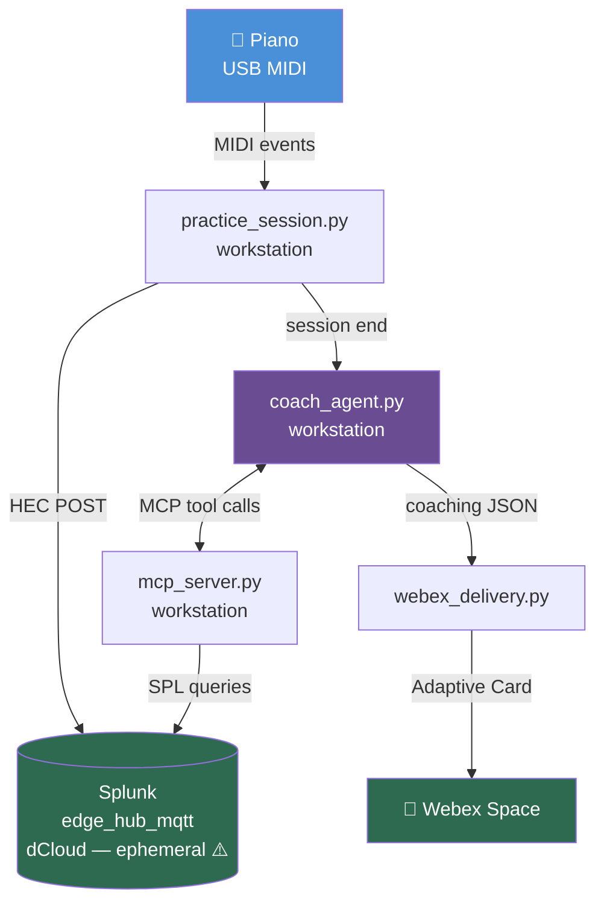
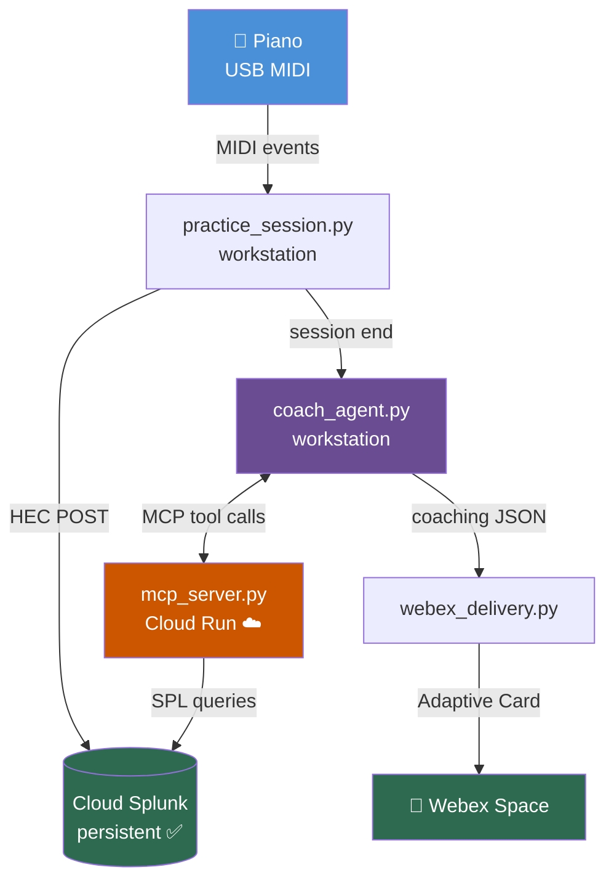
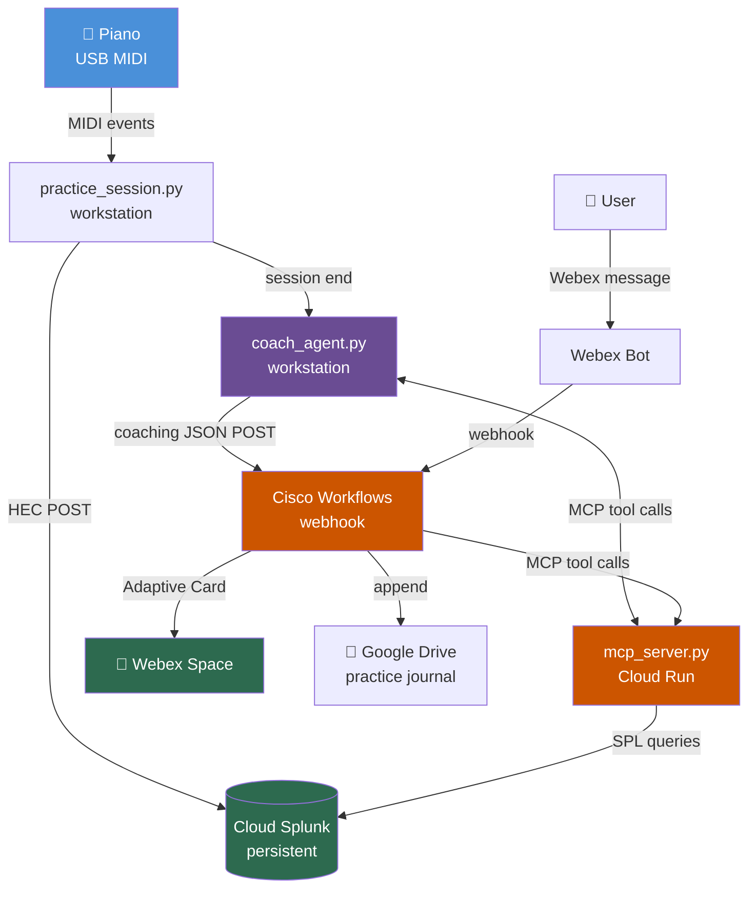

# AI Music Project — Implementation Plan
*Updated: April 26, 2026*

---

## Project Purpose

Two goals running in parallel:

1. **Learning lab** — use piano practice as a hands-on way to build skills across MIDI, data pipelines, AI APIs, MCP, agents, and automation platforms simultaneously.
2. **Presentation foundation** — demonstrate that personal interests are a powerful way to develop AI/data skills that transfer directly to work.

> *"I used my piano practice as a sensor network. Same patterns I use at work — I just learned them at home first."*

**Presentations this serves:**
- AI music / hobby-as-AI-lab demo
- Cisco Workflows standalone presentation (stretch goal — see Phase 1.5)

---

## What Is Already Built ✅

| Component | File | Status |
|-----------|------|--------|
| MIDI capture + scoring | `src/practice_session.py` | ✅ Complete |
| Direct Splunk HEC publisher | `src/hec_publisher.py` | ✅ Complete |
| MQTT publisher (fallback) | `src/mqtt_publisher.py` | ✅ Complete |
| MCP server (5 tools) | `src/mcp_server.py` | ✅ Complete |
| AI coach agent | `src/coach_agent.py` | ✅ Complete — tested live |
| Webex Adaptive Card delivery | `src/webex_delivery.py` | ✅ Complete — confirmed rendering |
| Session-end coach trigger | `src/practice_session.py` | ✅ Wired — untested end-to-end |
| Test scale simulator | `tools/send_test_scale.py` | ✅ Complete — upgraded with demo events + Reaper MIDI |
| MIDI recording tool | `tools/record_test_scale.py` | ✅ Complete — real C-major fixture captured |
| Animated demo dashboard | `src/demo_server.py` | ✅ Complete — Flask SSE, SVG pipeline, full node state machine |
| Demo event emitter | `src/demo_emitter.py` | ✅ Complete — fire-and-forget HTTP, opt-in via DEMO_SERVER_URL |
| MCP smoke test | `tools/test_mcp_tools.py` | ✅ Complete |

---

## Phase 1 — Core Pipeline (Local)
*Target: working prototype recorded by April 30, 2026*

### Architecture

```mermaid
flowchart TD
    A["🎹 Piano<br/>USB MIDI"] -->|MIDI events| B["practice_session.py<br/>workstation"]
    B -->|HEC POST| F[("Splunk<br/>edge_hub_mqtt<br/>dCloud — ephemeral ⚠️")]
    B -->|session end| C["coach_agent.py<br/>workstation"]
    C <-->|MCP tool calls| J["mcp_server.py<br/>workstation"]
    J -->|SPL queries| F
    C -->|coaching JSON| W["webex_delivery.py"]
    W -->|Adaptive Card| M["📱 Webex Space"]

    style A fill:#4a90d9,color:#fff
    style F fill:#2d6a4f,color:#fff
    style C fill:#6a4c93,color:#fff
    style M fill:#2d6a4f,color:#fff
```

Everything runs on the workstation. No tunnels. No cloud dependencies except Webex and the Claude API.

### Remaining Work

#### P1.1 — End-to-End Pipeline Test ✅ (mostly complete)
- ✅ `tools/send_test_scale.py` → events confirmed in Splunk
- ✅ Full pipeline working: play a scale → coaching → Webex card arrives
- ✅ `get_finger_trends` SPL deviation fix (IOI-based)
- ✅ Demo dashboard animates full pipeline end-to-end
- ✅ C8 listening mode — press top key to start session, A0 to end
- [ ] `tools/test_mcp_tools.py` → confirm MCP tools query Splunk correctly (smoke test)

#### P1.4 — Demo Rehearsal Path ✅
- ✅ `record_test_scale.py` captures real playing to JSON fixture
- ✅ `send_test_scale.py --reaper --midi-port "TestScale" --no-coach` replays through Reaper VST + dashboard
- [ ] Verify notes play through Reaper VST end-to-end (TestScale port wired, not yet confirmed)
- [ ] Run full rehearsal: dashboard + audio + simulated coaching

#### P1.2 — Cloud Splunk
The longitudinal coaching story ("your ring finger has been consistently late for 3 weeks") requires persistent data. dCloud rotates weekly and wipes all history.

**Options:**
| Option | Cost | Notes |
|--------|------|-------|
| Splunk Cloud free trial | Free 14 days | Cleanest path, cloud-accessible immediately |
| Splunk Free on GCP VM | ~$10–20/mo | Persistent, internet-reachable, free tier forever |

**Decision pending.** Once resolved: update `SPLUNK_URL`, `SPLUNK_HEC_URL`, and their 1Password entries. Everything else unchanged.

#### P1.5 — Demo Script / Narrative
Write a 5-minute script:
1. "I used my piano as a sensor network" — the setup
2. C8 to start, live notes appear in sidebar
3. A0 → watch the pipeline fire: Coaching Skill, MCP, charts, Webex in sequence
4. Coach card arrives in Webex — show card + chart
5. Close: "same patterns I use at work — agent, skill, MCP, tools"

Key talking point — Coaching Skill (purple node): "Not a separate file — it's the role
coach_agent.py plays. Discrete input: session_id + scale. Discrete output: coaching report.
In a larger system this would be a formal subagent. Here it's the conceptual boundary between
gathering data and thinking about it."

#### P1.3 — Pre-Record Demo Sessions
Once pipeline is stable, record 5–10 real practice sessions:
- Multiple scales (C, G, F, A major minimum)
- Visible improvement arc across sessions
- At least one session with a clear weak finger
- At least one session with a thumb-crossover timing anomaly

---

> 📝 **Checkpoint — write a project state note after P1.1 end-to-end test passes.**
> Include: what's working, current architecture diagram, key technical elements with brief explanations. Save to `notes/` as `YYYY-MM-DD_state_phase1-complete.md`.

---

## Phase 1.5 — Layer-on Demo Modes (presentation focus)
*Builds the artifacts that make the June presentation compelling. Not rip-and-replace — additive modes opt-in via env var. The existing per-segment card behavior keeps working.*

The June presentation arc requires three things the current pipeline doesn't have:
1. A way to **see what the agent is doing** while it runs (for the dissect section)
2. A way to **handle multiple repetitions** of the same scale gracefully (one summary, not five cards)
3. A **headline visual** that is unique to this project (the piano-key timing diagram)

These are not throwaway — each one becomes reusable when the Webex bot path is built later. The same summary aggregation feeds a "how am I doing on F major?" question; the same keyboard viz can be attached to any future card.

### P1.5.1 — Step-by-step demo orchestrator

Build a wrapper script (`tools/demo_orchestrator.py`) that imports the existing pipeline functions and writes a progressively-built Markdown log as it runs.

**Log format** — each section captures one stage of the run with:
- Header (e.g., "Tool: get_recent_sessions called")
- Plain-English explanation of what's happening
- Code snippet of the function being executed
- Partial Mermaid diagram that grows over the run (each stage adds nodes)

The log file is wiped and rewritten each run. One canonical log is saved separately for the presentation.

**Critical files:**
- `tools/demo_orchestrator.py` — new file
- Imports from `src/coach_agent.py`, `src/mcp_server.py` — no changes needed there
- Output: `data/demo_log.md` (and a presentation copy elsewhere)

### P1.5.2 — Summary mode (one card per scale-type per session)

Default behavior stays per-segment. Set `SESSION_SUMMARY_MODE=true` to:
- Suppress the per-segment card
- At session end, group segments by scale name
- For each scale-type, compute three views: **best run**, **average across reps**, **trend within session**
- Post one summary card per scale-type

**Critical files:**
- `src/practice_session.py` — gate the existing `_maybe_run_coach()` call on the env var; add a new session-end path
- `src/coach_agent.py` — add a `run_coach_summary(session_id, scale)` variant or extend `run_coach`
- `src/webex_delivery.py` — extend the card layout to accommodate three views + optional image attachment

### P1.5.3 — Two charts on the summary card

Generate two PNGs per summary card (one per scale-type per session):

1. **Cross-session trend** — line chart showing speed (BPM) and evenness (CV%) for this scale across recent sessions. The longitudinal story Splunk exists to tell. Auto-scales the time axis.
2. **Per-finger deviation** — horizontal bar chart, color-coded green/yellow/red by deviation magnitude, bidirectional (early vs. late). One chart per hand.

Both attached to the Webex message alongside the Adaptive Card. Detailed design and layout in `plan/ai_preso_v2_jun_2026/04_charts_design.md`.

**Critical files:**
- `src/charts.py` — new file. Two functions: `render_session_trend(scale, history) → Path` and `render_finger_deviation(metrics) → Path`. Uses `matplotlib`. Output saved to `data/viz/`.
- `src/webex_delivery.py` — attach PNGs via the Webex `files=` form field on `messages.create`.

**Deferred:** the 2-octave piano keyboard with finger-highlight visualization. Beautiful but high-effort and not the story driver — charts cover the same insight with less work. Parallel track via Claude Design (see `plan/ai_preso_v2_jun_2026/keyboard_viz_prompt.md`); fold into Volume III if compelling.

### P1.5.4 — Conversational Webex bot *(stretch within stretch — only if 1.5.1–1.5.3 land cleanly)*

This is the original Phase 1.5: Webex bot → Workflows webhook → ngrok → local `/coach` → freeform agent → card reply. With P1.5.1–P1.5.3 in place, the bot reuses every primitive without new infrastructure beyond the bot/Workflows/ngrok wiring.

Defer until summary mode and the keyboard viz are working.

---

## Phase 2 — Post-Draft-Presentation
*Begin after draft presentation submitted and Phase 1 demo is recorded*

### P2.1 — Cloud Splunk + Cloud MCP Server
*Do these together — the MCP server can only move to the cloud once Splunk is cloud-accessible.*

Move `src/mcp_server.py` to Cloud Run (already have the Dockerfile and Cloud Run familiarity from the earlier v1 architecture). `coach_agent.py` stays on the workstation — it's triggered by session end — but its MCP tools are now cloud-hosted and query cloud Splunk directly.

**Why this matters:**
- More realistic production architecture — tool servers don't run on laptops
- Good presentation talking point: MCP as a cloud service
- Creates a natural integration point for Workflows (Workflows can call MCP tools directly without needing ngrok or a local `/coach` service)

**Target architecture after P2.1:**

```mermaid
flowchart TD
    A["🎹 Piano<br/>USB MIDI"] -->|MIDI events| B["practice_session.py<br/>workstation"]
    B -->|HEC POST| F[("Cloud Splunk<br/>persistent ✅")]
    B -->|session end| C["coach_agent.py<br/>workstation"]
    C <-->|MCP tool calls| J["mcp_server.py<br/>Cloud Run ☁️"]
    J -->|SPL queries| F
    C -->|coaching JSON| W["webex_delivery.py"]
    W -->|Adaptive Card| M["📱 Webex Space"]

    style A fill:#4a90d9,color:#fff
    style F fill:#2d6a4f,color:#fff
    style C fill:#6a4c93,color:#fff
    style J fill:#cc5500,color:#fff
    style M fill:#2d6a4f,color:#fff
```

---

> 📝 **Checkpoint — write a project state note after P2.1 is working.**
> Include: what moved to cloud, why, architecture diagram, key technical elements. Save to `notes/` as `YYYY-MM-DD_state_cloud-mcp.md`.

---

### P2.2 — Claude Code Primitives Demo
Build concrete examples of all three Claude Code primitives as interactive coaching features:

- **Slash command** (`/analyze-session`) — runs full coaching analysis on the most recent session on demand
- **Skill** — a reusable packaged behavior, e.g. "scale compare" that contrasts two sessions side by side
- **Agent** — a multi-step agentic loop that autonomously pulls data, identifies a pattern, and asks follow-up questions

Goal: make each one distinct enough to clearly illustrate the concept. Strong presentation talking point: *"here's the difference between a command, a skill, and an agent — and here's each one doing something real."*

---

> 📝 **Checkpoint — write a project state note after P2.2 is working.**
> Include: what each primitive does, how they differ, a brief example of each in action. Save to `notes/` as `YYYY-MM-DD_state_claude-primitives.md`.

---

### P2.3 — Local LLM on MIDI Output
Deploy a local LLM (Ollama or similar) to do something interesting with raw MIDI data — the original project vision:
- Generate a musical response or countermelody from a recorded scale
- Classify playing style or mood from note patterns
- Chord detection using `music21`

Reconnects the project to its musical roots and contrasts the "observability/coaching" angle with generative AI.

### P2.4 — Coaching Report → Workflows Fan-Out
Workflows in a role that genuinely suits it: receiving the finished coaching report and distributing it.

**Target architecture after P2.4:**

```mermaid
flowchart TD
    A["🎹 Piano<br/>USB MIDI"] -->|MIDI events| B["practice_session.py<br/>workstation"]
    B -->|HEC POST| F[("Cloud Splunk<br/>persistent")]
    B -->|session end| C["coach_agent.py<br/>workstation"]
    C <-->|MCP tool calls| J["mcp_server.py<br/>Cloud Run"]
    J -->|SPL queries| F
    C -->|coaching JSON POST| WF["Cisco Workflows<br/>webhook"]
    WF -->|Adaptive Card| M["📱 Webex Space"]
    WF -->|append| GD["📄 Google Drive<br/>practice journal"]

    U["👤 User"] -->|Webex message| WB["Webex Bot"]
    WB -->|webhook| WF
    WF -->|MCP tool calls| J

    style A fill:#4a90d9,color:#fff
    style F fill:#2d6a4f,color:#fff
    style C fill:#6a4c93,color:#fff
    style J fill:#cc5500,color:#fff
    style WF fill:#cc5500,color:#fff
    style M fill:#2d6a4f,color:#fff
```

---

> 📝 **Checkpoint — write a project state note after P2.4 is working.**
> Include: how Workflows fits into the final architecture, what it does vs. what the cloud MCP server does, full architecture diagram. Save to `notes/` as `YYYY-MM-DD_state_phase2-complete.md`.

---

## Refactor Backlog
*Things worth doing eventually, not blocking anything today. Listed with their natural trigger.*

### R1 — Behavioral toggles: env vars → CLI flags

Today, `SUMMARY_MODE`, `AUTO_COACH`, `PUBLISHER_TYPE` are read from the environment. This works, but for a script run interactively (and demoed on stage), CLI flags would be more discoverable and visually obvious.

**What:** add `argparse` to `src/practice_session.py` and `src/coach_agent.py`. Flags override env vars override code defaults — keeps backward compatibility with the env-var path used in automation.

**Why:** self-documenting (`--help`), no hidden state on stage, more idiomatic for an interactive tool.

**When:** any time. Low priority — current env-var path works.

### R2 — Extract a unified coach API

Today, the CLI imports `run_coach()` and `run_coach_summary()` directly. The MCP server is a separate API surface. The eventual Webex bot, web UI, and any future client would each need their own integration path.

**What:** wrap the coaching surface (`run_coach`, `run_coach_summary`, possibly freeform queries) in a Flask/FastAPI service. CLI calls the API; agent (via MCP) calls the API; Webex bot calls the API. `src/cloud_run_app.py` is the parked starting point — it already has the `/coach` endpoint.

**Why:** single source of truth for the coaching logic; new clients become thin shims; aligns with the Phase 2.1 cloud MCP architecture and the parked Cloud Run plan.

**Caveat:** adds operational complexity now (start the service before running the CLI). Premature extraction with one consumer is real cost. Wait for the *second* consumer.

**When:** trigger this refactor when starting work on either:
- The Webex bot path (Phase 1.5 stretch / P1.5.4) — second consumer arrives
- Cloud MCP server (Phase 2.1) — natural deployment target for the API itself

### R3 — End-session signal from the piano (no more Ctrl+C wrestling)

Today, ending a session relies on Ctrl+C through `op run`, which on Windows has flaky signal forwarding (the first Ctrl+C often gets swallowed by op CLI; user has to press it again). A cleaner approach: let the player end the session by pressing the lowest note on the keyboard — A0 (MIDI 21 in our note-naming convention, the leftmost key on a standard 88-key piano).

**What:** in the MIDI callback in `practice_session.py`, treat MIDI 21 as a sentinel: process the final segment, run summary if applicable, disconnect cleanly. Also useful as a "manual segment break" signal — the player never has to take their hands off the keyboard to control the script.

**Why:** removes the op-run/Ctrl+C bumpy moment from the demo recording; cleaner ergonomics live; clean test coverage of the post-session path.

**Caveat:** if the player legitimately uses A0 in a piece, this would prematurely end the session. For scale practice (current scope) it's safe — no scale fingering uses MIDI 21. Document the behavior; could be made configurable later.

**When:** before the demo recording session.

---

## Open Issues

| Issue | Status |
|-------|--------|
| Cloud Splunk instance | Decision pending — required for longitudinal coaching and Phase 2 |
| `get_finger_trends` SPL fix | ✅ Fixed April 25 (IOI-based deviation) |
| ngrok tier (Phase 1.5 stretch only) | Paid required for fixed subdomain |
